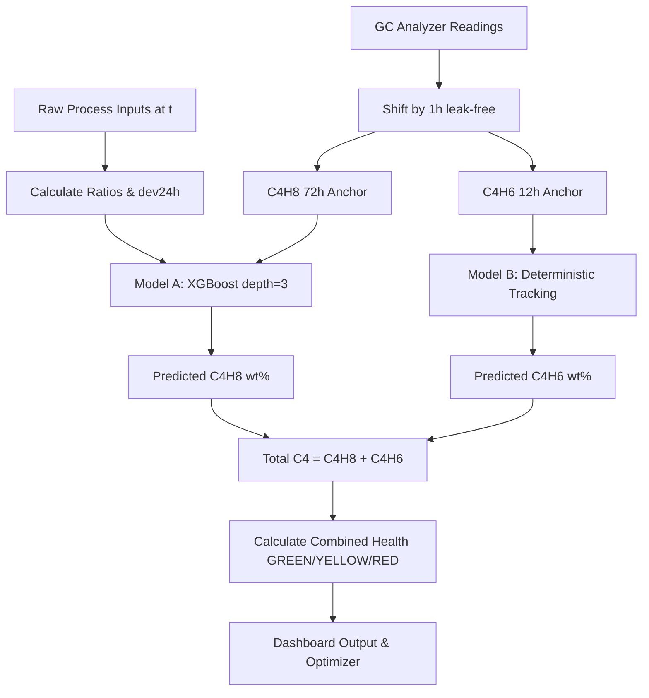

# 07. Final Architecture

The final Debutanizer soft-sensor is designed as a **dual-sensor architecture** running online in the DCS system:

## 1. Model A (C4H8)
*   **Predictor**: XGBoost Regressor (`max_depth = 3`).
*   **Features**: 8 robust physical features (ratios, 24h deviations, and 72h campaign anchor).
*   **Fallback**: 24h rolling mean of predictions (Yellow), defaulting to campaign mean of **$0.480$ wt%** (Red) if offline $> 168$ hours.

## 2. Model B (C4H6)
*   **Predictor**: Deterministic state estimator (No-ML).
*   **Features**: `C4H6_campaign_anchor` (12h limit).
*   **Fallback**: 24h rolling mean of the anchor (Yellow), defaulting to campaign mean of **$0.005663$ wt%** (Red) if offline $> 168$ hours or if predictions are $< 6$.

## 3. Combined Health Status Logic
The unified prediction script outputs a `"prediction_health"` status to alert operators:

*   **`GREEN`**: Both Model A and Model B campaign anchors are available and healthy. Analyzer tracking is active.
*   **`YELLOW`**: At least one analyzer is offline/stuck, and the system is using the 24-hour rolling average predictions.
*   **`RED`**: Emergency fallback active. At least one analyzer has been offline for $> 168$ hours (7 days), or too few recent predictions are available. The prediction falls back directly to safe campaign baseline means.

## 4. Safety Ceilings (Absolute Ceilings)
The dashboard and optimizer enforce hard-coded safety limits:
*   `Column_Bottom_Temp` $\le 115.0$ °C (Shutdown threshold).
*   `Column_Top_Pressure` $\le 5.0\text{ kg/cm}^2\text{g}$ (Trip threshold).
