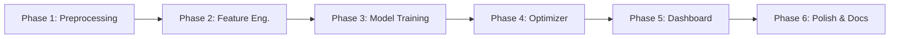
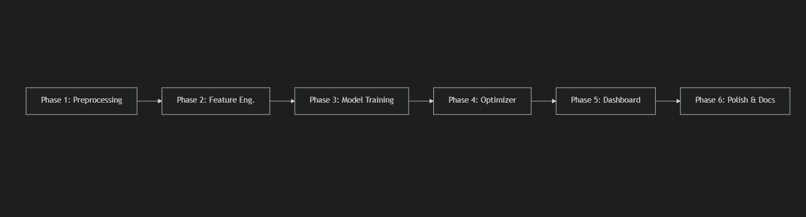

# AI-Based Model to Minimize C4 Slippage in Debutanizer

## Dataset Analysis Findings

### Overview
- **Dataset**: [9.DB DATA -B.xlsx](file:///c:/Users/KIIT/OneDrive/Desktop/DEBUTANIZER-model/9.DB%20DATA%20-B.xlsx) — 11,399 hourly rows (after removing 2 header rows)
- **Date Range**: April 2023 → April 2026 (~3 years)
- **Columns**: 8 process variables + 2 target outputs (C4H6 wt%, C4H8 wt%)
- **Sampling**: Hourly (1-hour median interval), only 2 gaps > 2 hours

### Data Columns

| Column | Tag ID | Unit | Description |
|--------|--------|------|-------------|
| Feed Flow | 1145FIC1101 | TPH | Feed flow to debutanizer |
| Reboiler Outlet Temp | 1150TI1107 | °C | Reboiler outlet temperature |
| Column Top Temp | 1150TI1202 | °C | Column top temperature |
| Reboiling Steam Flow | 1150FIC1101 | TPH | LP steam flow |
| Reflux Flow | 1150FIC1202 | TPH | Reflux flow |
| Column Top Pressure | 1150PIC1101 | kg/cm²g | Column top pressure |
| Column Bottom Temp | 1150TI1105 | °C | Column bottom temperature |
| Control Tray Temp | 1150TIC1101 | °C | Control tray temperature |
| **C4H6 in DB Bottom** | 1150AI14011F | Wt% | Butadiene slippage (target 1) |
| **C4H8 in DB Bottom** | 1150AI14011G | Wt% | Butylene slippage (target 2) |

### Target Variable: Total C4 Slippage (C4H6 + C4H8)

| Stat | Value |
|------|-------|
| Mean | 0.50 wt% |
| Median | 0.40 wt% |
| Std | 0.37 wt% |
| Min | 0.00007 wt% |
| Max | 2.75 wt% |
| **% exceeding 0.5 spec** | **39.9%** |
| % exceeding 1.0 | 10.9% |
| % exceeding 1.5 | 1.5% |

> [!IMPORTANT]
> Nearly **40% of the time**, the plant exceeds the 0.5 wt% spec — confirming the problem statement is real and significant.

---

### Critical Data Quality Issues Found

#### 1. 🚨 Massive 13-Month Data Gap
The monthly breakdown reveals the data is NOT continuous:
- **Block 1**: Apr 2023 – Aug 2023 (5 months, ~3,288 rows)
- **GAP**: Sep 2023 – Aug 2024 (13 months missing!)
- **Block 2**: Sep 2024 – Nov 2024 (3 months, ~1,541 rows)
- **GAP**: Dec 2024 (missing)
- **Block 3**: Aug 2025 – Apr 2026 (9 months, ~6,514 rows)

> [!WARNING]
> The 13-month gap means **we cannot simply do a chronological train/test split**. We must treat the data blocks carefully — there may be different operating regimes, seasonal effects, or equipment changes across blocks.

#### 2. 🚨 Bimodal Distribution in Key Variables
- **Reboiler Outlet Temp**: 58% below 50°C, 42% above 50°C (mean 65°C, but 25th percentile is 34°C and 75th is 107°C) — this is clearly **two operating regimes**
- **Column Top Temp**: 41% below 50°C, 59% above 50°C — same bimodal pattern
- This likely indicates **different feed compositions or seasonal operating conditions**

#### 3. 🚨 Stuck Analyzer Readings (Unreliable Analyzer)
- **C4H6**: 42.7% of readings are repeats; max 889 consecutive identical readings (~37 days!)
- **C4H8**: 7.6% repeats; max 333 consecutive identical readings (~14 days)
- This confirms the problem statement: the analyzer is unreliable and often stuck/frozen

> [!CAUTION]
> The C4H6 analyzer is extremely unreliable — nearly half its readings are just repeats of the previous value. The C4H8 analyzer is much better. We should consider making **C4H8 the primary target** or building separate models. The analyzer reliability issue is actually **why we're building this soft sensor** — to replace/supplement the unreliable analyzer.

#### 4. Plant Shutdown Periods
- **56 rows** where ALL process variables = 0 simultaneously (plant was offline)
- These must be removed before modeling

#### 5. Outliers
- Feed Flow: 3.0% outliers
- Reboiling Steam Flow: 2.3%
- Total C4: 2.0%
- Column Bottom Temp: 1.6%
- Not extreme — mostly process upsets, should be capped rather than removed

---

### Correlation Analysis

#### Static (Lag-0) Correlations with Total_C4
| Variable | Correlation |
|----------|-------------|
| Feed Flow | **+0.169** (higher feed → more slippage) |
| Column Top Pressure | **+0.166** (higher pressure → more slippage) |
| Control Tray Temp | +0.037 |
| Column Top Temp | +0.037 |
| Column Bottom Temp | -0.000 |
| Reboiling Steam Flow | -0.041 |
| Reboiler Outlet Temp | -0.055 |
| Reflux Flow | **-0.071** (more reflux → less slippage) |

> [!NOTE]
> Static correlations are **weak** (all < 0.17). This is expected because:
> 1. The debutanizer has a **time-delayed response** (you correctly identified this)
> 2. The relationship is **nonlinear** — tree-based models will capture this better than linear correlation suggests
> 3. The analyzer readings are noisy/stuck, diluting correlation

#### Lagged Correlations
The lag analysis shows modest improvement at lags 1-4h for some variables:
- **Feed Flow**: peaks at lag 1h (+0.172) — makes sense, more feed means more C4 to separate
- **Reflux Flow**: improves at lag 6-12h (-0.076) — reflux change takes time to effect separation
- **Reboiler Outlet Temp**: improves at lag 12h (-0.064) — thermal effects are slow
- **Control Tray Temp**: peaks at lag 3-4h (+0.055) — intermediate response time

#### Autocorrelation of Total_C4 (Very High!)
| Lag | Autocorrelation |
|-----|----------------|
| 1h | **0.938** |
| 2h | 0.891 |
| 3h | 0.861 |
| 6h | 0.794 |
| 12h | 0.724 |
| 24h | 0.724 |

> [!IMPORTANT]
> The target variable is **extremely autocorrelated** (0.94 at lag 1). This means:
> 1. **Past C4 values are the strongest predictor of future C4** — we MUST include lagged target as a feature
> 2. The model should be framed as a **time-series regression**, not a static prediction
> 3. A naive "predict C4(t) = C4(t-1)" model would already achieve R² ≈ 0.88 — our model must beat this baseline significantly

---

## Open Questions

> [!IMPORTANT]
> **Q1: Target variable** — Should we predict **Total C4 (C4H6 + C4H8)** or **C4H8 only** (since C4H6 analyzer is unreliable with 43% stuck readings)?
> My recommendation: Predict **C4H8** as the primary output (more reliable analyzer), and optionally predict Total C4 as a secondary output.

> [!IMPORTANT]
> **Q2: Cost calculation** — The problem mentions potential losses of "1-2 crores/hr". Do you have the **actual cost formula** (₹ per kg of C4 lost, or per wt% above spec)? I'll need this for the dashboard's INR/hr loss calculator. For now, I'll use a placeholder formula: `Loss = (C4_actual - 0.5) × Feed_Flow × C4_price_per_ton` which we can calibrate later.

> **Q3: Data gaps** — The 13-month gap (Sep 2023 – Aug 2024) — was this a planned shutdown, or is data simply missing? This affects how we handle the block boundaries.

> **Q4: Two operating regimes** — The bimodal temperature distributions suggest two distinct operating modes. Do you know what these are? (e.g., seasonal changes, different feed slate, different product specs?)

---

## Proposed Changes

### Phase 1: Data Preprocessing Pipeline

#### [NEW] [data_preprocessing.py](file:///c:/Users/KIIT/OneDrive/Desktop/DEBUTANIZER-model/data_preprocessing.py)

Complete data cleaning pipeline:

1. **Parse & rename columns** (tag IDs → human-readable names)
2. **Remove header rows** (rows 0-1 contain tag IDs and units)
3. **Remove shutdown rows** (56 rows where all process vars = 0)
4. **Handle stuck analyzer readings**:
   - Flag runs of >12 consecutive identical C4H6 readings as "stuck"
   - During stuck periods, interpolate C4H6 from surrounding valid readings OR mark as NaN for training exclusion
   - C4H8 is much more reliable — use as-is with minor smoothing
5. **Outlier capping**: Winsorize at 1st/99th percentile (not remove — process upsets carry information)
6. **Handle bimodal regimes**: Add a binary `operating_regime` feature based on Reboiler Outlet Temp threshold (~50°C)
7. **Create time features**: hour_of_day, day_of_week, month (cyclical encoding)
8. **Handle data gaps**: Split into contiguous blocks; only create lag features within blocks (no crossing gaps)
9. **Output**: Clean parquet file ready for feature engineering

---

### Phase 2: Feature Engineering

#### [NEW] [feature_engineering.py](file:///c:/Users/KIIT/OneDrive/Desktop/DEBUTANIZER-model/feature_engineering.py)

Time-lagged features (the key insight you identified):

**Lagged Process Variables** (for each of the 8 process vars):
- `{var}_lag1, {var}_lag2, {var}_lag3` (1-3 hour lags)
- `{var}_lag6, {var}_lag12` (for slower-responding variables)

**Lagged Target Variables** (critical due to high autocorrelation):
- `C4_lag1, C4_lag2, C4_lag3, C4_lag6, C4_lag12`

**Rolling Statistics** (capture trends):
- `{var}_rolling_mean_3h, {var}_rolling_mean_6h, {var}_rolling_mean_12h`
- `{var}_rolling_std_3h` (variability indicator — unstable operation = more slippage)

**Engineered Ratios**:
- `Reflux_Ratio = Reflux_Flow / Feed_Flow`
- `Steam_Feed_Ratio = Steam_Flow / Feed_Flow`
- `Temp_Gradient = Bottom_Temp - Top_Temp`
- `Reboiler_Delta = Reboiler_Outlet - Bottom_Temp`

**Rate-of-Change Features**:
- `{var}_diff1 = {var}(t) - {var}(t-1)` for key variables
- These capture whether steam/reflux is increasing or decreasing

**Operating Regime**:
- Binary regime indicator based on temperature clusters

Total estimated features: **~80-100** (will use feature selection to prune)

---

### Phase 3: Model Training

#### [NEW] [model_training.py](file:///c:/Users/KIIT/OneDrive/Desktop/DEBUTANIZER-model/model_training.py)

**Primary Model: XGBoost Regressor** (recommended over Gradient Boosting for several reasons):
- Better regularization (L1/L2), preventing overfitting on noisy analyzer data
- Faster training on ~11K rows with 80+ features
- Built-in feature importance for interpretability
- Handles the nonlinear relationships well

**Model Architecture**:
```
Input Features (80+) → XGBoost → Predicted C4 wt%
                                → Feature Importance Rankings
                                → SHAP explanations (per prediction)
```

**Training Strategy**:
1. **Block-aware splitting**: Don't split randomly. Use Block 1 + Block 2 for training, Block 3 (most recent) for validation/testing
2. **Time-series cross-validation**: Within training data, use expanding window CV (not random K-fold — would leak future information)
3. **Baseline model**: Naive lag-1 predictor (R² ≈ 0.88) — our model must beat this
4. **Hyperparameter tuning**: Bayesian optimization with Optuna over learning_rate, max_depth, n_estimators, colsample_bytree, subsample, reg_alpha, reg_lambda
5. **Evaluation metrics**: MAE, RMSE, R², MAPE, and custom "% of time prediction is within ±0.1 wt% of actual"

**Secondary Model: LSTM/GRU** (optional, if time permits):
- Better at capturing temporal dependencies natively
- But requires more data and careful tuning
- Would compare against XGBoost as a benchmark

---

### Phase 4: Optimization Engine

#### [NEW] [optimizer.py](file:///c:/Users/KIIT/OneDrive/Desktop/DEBUTANIZER-model/optimizer.py)

The "what-if simulator" — given current state, find optimal setpoints:

1. **Load trained XGBoost model**
2. **Define optimization objective**: Minimize predicted C4 wt% subject to:
   - Steam flow within [min, max] operating limits
   - Reflux flow within [min, max] operating limits
   - Bottom temp within [min, max] operating limits
   - Total energy (steam + reflux) ≤ budget constraint
3. **Solver**: Grid search or scipy.optimize over the manipulable variables (Steam, Reflux, Bottom Temp)
4. **Output**: 
   - Recommended setpoints
   - Expected C4 reduction
   - Energy cost of the change
   - Estimated INR savings per hour

---

### Phase 5: Streamlit Dashboard

#### [NEW] [app.py](file:///c:/Users/KIIT/OneDrive/Desktop/DEBUTANIZER-model/app.py)

Full operator dashboard with 4 tabs:

**Tab 1: Live Prediction**
- Current process values input (can be manual or from CSV upload)
- Real-time C4 prediction gauge (color-coded: green < 0.3, yellow 0.3-0.5, red > 0.5)
- Confidence interval display
- Feature contribution waterfall (SHAP)

**Tab 2: Actual vs Predicted Trends**
- Time-series chart with actual C4 (from analyzer) and predicted C4 overlaid
- Residual plot
- Model accuracy metrics (MAE, RMSE, R²)
- Anomaly detection: flag when predicted ≠ actual by > threshold (analyzer may be stuck)

**Tab 3: Operator Recommendations**
- Current operating point vs optimal
- Recommended steam/reflux adjustments
- Expected C4 reduction
- **Loss Calculator**: INR/hr being lost at current C4 level
- "What-if" simulator: operator can adjust sliders and see predicted impact

**Tab 4: Analytics & Reports**
- Monthly C4 trend analysis
- Feature importance rankings
- Operating regime analysis
- PDF report generation (using reportlab)

---

### Phase 6: Supporting Files

#### [MODIFY] [requirements.txt](file:///c:/Users/KIIT/OneDrive/Desktop/DEBUTANIZER-model/requirements.txt)
Add: `scikit-learn`, `optuna`, `shap`, `plotly`, `joblib`

#### [NEW] [config.py](file:///c:/Users/KIIT/OneDrive/Desktop/DEBUTANIZER-model/config.py)
Central configuration: file paths, column mappings, operating limits, cost parameters, model hyperparameters.

#### [DELETE] [analyze_data.py](file:///c:/Users/KIIT/OneDrive/Desktop/DEBUTANIZER-model/analyze_data.py)
Temporary analysis script — findings captured in this document.

---

## Verification Plan

### Automated Tests
1. **Preprocessing**: Verify no NaN/inf values in output, correct row count, correct data types
2. **Feature engineering**: Verify lag features are correctly aligned (no look-ahead bias)
3. **Model performance**: 
   - Must beat naive lag-1 baseline (R² > 0.88)
   - Target MAE < 0.05 wt%, R² > 0.92 on test set
   - Cross-validation stability: std(R²) < 0.05 across folds
4. **Dashboard**: Run Streamlit app locally, verify all tabs load, charts render, predictions match model output

### Manual Verification
- Upload the original Excel data through the dashboard and verify predictions visually match trends
- Test the what-if simulator with known scenarios (e.g., "increase steam by 10%" → expect C4 decrease)
- Generate PDF report and verify completeness

---

## Execution Order



Estimated effort: ~4-6 hours total.

