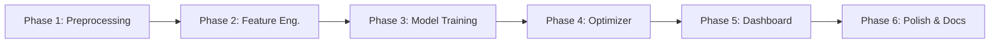

# AI-Based Model to Minimize C4 Slippage in Debutanizer

## Dataset Analysis Findings

### Overview
- **Dataset**: [9.DB DATA -B.xlsx](file:///c:/Users/KIIT/OneDrive/Desktop/DEBUTANIZER-model/9.DB%20DATA%20-B.xlsx) — 11,399 hourly rows (after removing 2 header rows)
- **Date Range**: April 2023 → April 2026 (~3 years)
- **Columns**: 8 process variables + 2 target outputs (C4H6 wt%, C4H8 wt%)
- **Sampling**: Hourly (1-hour median interval), only 2 gaps > 2 hours

### Data Columns

| Column | Tag ID | Unit | Description |
|--------|--------|------|-------------|
| Feed Flow | 1145FIC1101 | TPH | Feed flow to debutanizer |
| Reboiler Outlet Temp | 1150TI1107 | °C | Reboiler outlet temperature |
| Column Top Temp | 1150TI1202 | °C | Column top temperature |
| Reboiling Steam Flow | 1150FIC1101 | TPH | LP steam flow |
| Reflux Flow | 1150FIC1202 | TPH | Reflux flow |
| Column Top Pressure | 1150PIC1101 | kg/cm²g | Column top pressure |
| Column Bottom Temp | 1150TI1105 | °C | Column bottom temperature |
| Control Tray Temp | 1150TIC1101 | °C | Control tray temperature |
| **C4H6 in DB Bottom** | 1150AI14011F | Wt% | Butadiene slippage (target 1) |
| **C4H8 in DB Bottom** | 1150AI14011G | Wt% | Butylene slippage (target 2) |

### Target Variable: Total C4 Slippage (C4H6 + C4H8)

| Stat | Value |
|------|-------|
| Mean | 0.50 wt% |
| Median | 0.40 wt% |
| Std | 0.37 wt% |
| Min | 0.00007 wt% |
| Max | 2.75 wt% |
| **% exceeding 0.5 spec** | **39.9%** |
| % exceeding 1.0 | 10.9% |
| % exceeding 1.5 | 1.5% |

> [!IMPORTANT]
> Nearly **40% of the time**, the plant exceeds the 0.5 wt% spec — confirming the problem statement is real and significant.

---

### Critical Data Quality Issues Found

#### 1. 🚨 13-Month Data Gap (Missing Data, Not Shutdown)
The monthly breakdown reveals the data is NOT continuous:
- **Block 1**: Apr 2023 – Aug 2023 (5 months, ~3,288 rows)
- **GAP**: Sep 2023 – Aug 2024 (13 months — data not recorded/exported)
- **Block 2**: Sep 2024 – Nov 2024 (3 months, ~1,541 rows)
- **GAP**: Dec 2024 (missing)
- **Block 3**: Aug 2025 – Apr 2026 (9 months, ~6,514 rows)

> [!WARNING]
> Since this is a data gap (not a plant shutdown), we must treat blocks independently for lag feature creation. No lag features should span across block boundaries.

#### 2. 🚨 Bimodal Distribution in Key Variables
- **Reboiler Outlet Temp**: 58% below 50°C, 42% above 107°C — **two operating regimes** (cause unknown; model will auto-detect via clustering or the data itself)
- **Column Top Temp**: 41% below 50°C, 59% above 50°C — same bimodal pattern
- **Strategy**: Add binary `operating_regime` feature via K-Means clustering; train model across both regimes — tree-based models handle this naturally

#### 3. 🚨 Stuck Analyzer Readings (Unreliable C4H6 Analyzer)
- **C4H6**: 42.7% of readings are repeats; max 889 consecutive identical readings (~37 days!)
- **C4H8**: 7.6% repeats; max 333 consecutive identical readings (~14 days)

> [!IMPORTANT]
> **Strategy for handling unreliable C4H6**: Since the requirement is to predict **Total C4 (C4H6 + C4H8)**, we'll use a **two-model ensemble approach**:
> 1. **Model A** — Predict C4H8 directly (reliable analyzer, good training signal)
> 2. **Model B** — Predict C4H6 directly, but trained **only on non-stuck readings** (filter out runs of >12 consecutive identical values; ~6,500 valid rows remain)
> 3. **Total C4 = Model A output + Model B output**
> 
> This way, each model learns from its best-quality data rather than training on a noisy combined target.

#### 4. Plant Shutdown Periods
- **56 rows** where ALL process variables = 0 simultaneously — removed before modeling

#### 5. Outliers
- Feed Flow: 3.0% outliers, Reboiling Steam: 2.3%, Total C4: 2.0%
- Not extreme — capped at 1st/99th percentile (not removed)

---

### Correlation & Time-Delay Analysis

#### What Drives High C4 Slippage?
Comparison of operating conditions when C4 is **low (<0.3%)** vs **high (>0.8%)**:

| Variable | Low C4 Mean | High C4 Mean | Difference | Interpretation |
|----------|-------------|--------------|------------|----------------|
| Feed Flow | 80.3 TPH | 85.8 TPH | **+5.4** | Higher feed → more slippage |
| Reflux Flow | 92.8 TPH | 90.6 TPH | **-2.2** | Less reflux → more slippage |
| Reboiling Steam | 21.2 TPH | 20.8 TPH | **-0.3** | Less steam → more slippage |
| Reboiler Outlet Temp | 66.2°C | 56.9°C | **-9.3** | Lower temp → more slippage |
| Column Top Pressure | 4.01 | 4.15 | **+0.14** | Higher pressure → more slippage |

> [!NOTE]
> **Steam and Reflux are highly correlated** (r = 0.88). The optimizer must account for this — changes to one will likely require coordinated changes to the other.

#### Autocorrelation of Total_C4 (Very High!)
| Lag | Autocorrelation |
|-----|----------------|
| 1h | **0.938** |
| 6h | 0.794 |
| 12h | 0.724 |
| 24h | 0.724 |

Past C4 values are the strongest predictor. Naive baseline (C4(t) = C4(t-1)) achieves R² ≈ 0.88.

---

## Model Constraints & Operating Limits

> [!CAUTION]
> The optimizer must **never** recommend values outside safe operating limits. Extreme recommendations could cause column flooding, foaming, pressure surges, or emergency shutdown.

### Constraint Strategy

1. **Hard Limits** (from data P1-P99 + refinery literature): Model output is clipped — **never** exceeded
2. **Recommended Operating Range** (from data P5-P95): Optimizer searches **only within this range**
3. **Rate-of-Change Limits**: Maximum allowed change per hour — prevents sudden dangerous swings (the ±50% idea expressed as a rate constraint)

### Manipulable Variables (Optimizer Can Adjust)

| Variable | Unit | Hard Min | Rec. Min | Mean | Rec. Max | Hard Max | Max Δ/hr |
|----------|------|----------|----------|------|----------|----------|----------|
| Reboiling Steam Flow | TPH | 14.4 | 18.0 | 21.0 | 24.4 | 25.3 | ±2.0 |
| Reflux Flow | TPH | 70.4 | 80.0 | 91.1 | 103.9 | 105.7 | ±5.0 |

### Monitored Variables (Constraints — Optimizer Must Respect)

| Variable | Unit | Hard Min | Rec. Min | Mean | Rec. Max | Hard Max | Trip/Alarm |
|----------|------|----------|----------|------|----------|----------|------------|
| Column Bottom Temp | °C | 99.0 | 102.6 | 107.0 | 111.5 | 113.0 | >115°C alarm |
| Control Tray Temp | °C | 57.2 | 59.1 | 71.6 | 89.7 | 91.3 | — |
| Column Top Pressure | kg/cm²g | 3.78 | 3.85 | 4.05 | 4.45 | 4.55 | >5.0 trip |
| Feed Flow | TPH | 44.6 | 65.4 | 83.3 | 95.3 | 99.3 | Disturbance (not controlled) |

### Constraint Sources

| Source | What It Provides |
|--------|-----------------|
| **Historical data (P5-P95)** | The "normal" operating envelope — values within which the plant has successfully operated 90% of the time |
| **Historical data (P1-P99)** | Hard limits — only 1% of data falls outside these |
| **Refinery literature** | Typical debutanizer overhead temp: 40-70°C, bottoms: 100-150°C, pressure: 5-16 bar. Our data (3.8-4.6 kg/cm²g ≈ 3.7-4.5 bar) operates on the lower end — consistent with LP steam reboiling |
| **Safety considerations** | Flooding risk at high reflux, fouling risk at high reboiler temp (>125°C), pressure trip at >5 kg/cm²g |

### Rate-of-Change Constraints (Preventing Sudden Swings)
Instead of a blanket ±50% of current value, we use **maximum allowed step change per hour**:

```
Steam: max ±2.0 TPH/hr   (≈10% of mean, prevents thermal shock to reboiler)
Reflux: max ±5.0 TPH/hr  (≈5% of mean, prevents flooding/weeping)
```

These were derived from the 95th percentile of actual hourly changes observed in the data, so they represent the range operators historically adjust within.

---

## Resolved Questions

| Question | Resolution |
|----------|-----------|
| Target variable | **Total C4 (C4H6 + C4H8)** — Two-model ensemble: predict C4H8 and C4H6 separately, sum for Total C4 |
| Cost formula | Placeholder: `Loss_INR_per_hr = max(0, C4_predicted - 0.5) × Feed_Flow × 1000 × C4_price_per_kg` (calibrate later with actual economics) |
| Data gap | Missing data export, not shutdown. Handle by splitting into contiguous blocks |
| Operating regimes | Unknown cause. Model will auto-detect via the data; tree-based model handles bimodal distributions naturally |
| Constraints | Data-driven limits (P5-P95 for optimizer, P1-P99 as hard limits) validated against refinery literature |

---

## Proposed Changes

### Phase 1: Data Preprocessing Pipeline

#### [NEW] [data_preprocessing.py](file:///c:/Users/KIIT/OneDrive/Desktop/DEBUTANIZER-model/data_preprocessing.py)

Complete data cleaning pipeline:

1. **Parse & rename columns** (tag IDs → human-readable names)
2. **Remove header rows** (rows 0-1 contain tag IDs and units)
3. **Remove shutdown rows** (56 rows where all process vars = 0)
4. **Handle stuck analyzer readings**:
   - Detect runs of >12 consecutive identical C4H6 readings → mark as `C4H6_stuck = True`
   - For **Model B training**: exclude stuck rows (keep ~6,500 valid rows)
   - For **Model A**: C4H8 is reliable, use all rows
5. **Outlier capping**: Winsorize at 1st/99th percentile
6. **Identify data blocks**: Label contiguous time blocks (Block 1/2/3) to prevent lag features from crossing gaps
7. **Create time features**: hour_of_day, day_of_week, month (cyclical sine/cosine encoding)
8. **Output**: Clean parquet file ready for feature engineering

---

### Phase 2: Feature Engineering

#### [NEW] [feature_engineering.py](file:///c:/Users/KIIT/OneDrive/Desktop/DEBUTANIZER-model/feature_engineering.py)

**Lagged Process Variables** (for each of 8 process vars):
- `{var}_lag1, {var}_lag2, {var}_lag3` (1-3 hour lags)
- `{var}_lag6, {var}_lag12` (slower response variables)
- **Only within contiguous blocks** — no lag across data gaps

**Lagged Target Variables** (critical — autocorrelation 0.94):
- `C4H8_lag1, C4H8_lag2, C4H8_lag3, C4H8_lag6, C4H8_lag12`
- `C4H6_lag1, C4H6_lag2, C4H6_lag3` (for non-stuck periods only)

**Rolling Statistics**:
- `{var}_rolling_mean_3h, _6h, _12h`
- `{var}_rolling_std_3h` (variability = instability)

**Engineered Ratios**:
- `Reflux_Ratio = Reflux / Feed`
- `Steam_Feed_Ratio = Steam / Feed`
- `Temp_Gradient = Bottom - Top`
- `Reboiler_Delta = Reboiler_Outlet - Bottom`

**Rate-of-Change** (captures dynamic behavior):
- `{var}_diff1 = {var}(t) - {var}(t-1)` for Steam, Reflux, Feed, Bottom Temp

**Operating Regime** (auto-detected):
- Binary feature from K-Means on [Reboiler_Outlet_Temp, Column_Top_Temp]

Total estimated features: **~80-100** → pruned via feature importance

---

### Phase 3: Model Training

#### [NEW] [model_training.py](file:///c:/Users/KIIT/OneDrive/Desktop/DEBUTANIZER-model/model_training.py)

**Two-Model Ensemble Architecture**:

```
                   ┌──────────────────┐
Process Features ──┤  Model A (XGBoost)├──► Predicted C4H8 ──┐
 + Lag features    │  (all rows)      │                      │
                   └──────────────────┘                      ├──► Total C4
                   ┌──────────────────┐                      │
Process Features ──┤  Model B (XGBoost)├──► Predicted C4H6 ──┘
 + Lag features    │  (non-stuck only)│
                   └──────────────────┘
```

**Training Strategy**:
1. **Block-aware split**: Block 1+2 for training, Block 3 for test (most recent = most realistic)
2. **Time-series CV**: Expanding window within training set
3. **Baseline**: Naive lag-1 predictor (R² ≈ 0.88) — must beat this
4. **Hyperparameter tuning**: Optuna Bayesian optimization
5. **Constraint-aware validation**: Verify model never predicts C4 < 0 or > 3.0 wt%

**Metrics**: MAE, RMSE, R², MAPE, % within ±0.1 wt% of actual

---

### Phase 4: Constrained Optimization Engine

#### [NEW] [optimizer.py](file:///c:/Users/KIIT/OneDrive/Desktop/DEBUTANIZER-model/optimizer.py)

**Constrained optimizer** that respects all operating limits:

```python
# Pseudo-code for optimizer
minimize:  predicted_C4(steam, reflux, ...)
subject to:
    18.0 <= steam <= 24.4                    # Recommended range
    80.0 <= reflux <= 103.9                  # Recommended range
    |steam_new - steam_current| <= 2.0       # Rate constraint
    |reflux_new - reflux_current| <= 5.0     # Rate constraint
    predicted_bottom_temp <= 111.5           # Safety constraint
    predicted_pressure <= 4.45               # Safety constraint
```

- Uses `scipy.optimize.minimize` with bounds and constraints
- Falls back to grid search if optimization fails
- **Energy penalty term**: `total_cost = C4_loss_cost - energy_savings` (balance recovery vs energy)
- Outputs: recommended setpoints, expected C4 reduction, energy trade-off, INR savings

---

### Phase 5: Streamlit Dashboard

#### [NEW] [app.py](file:///c:/Users/KIIT/OneDrive/Desktop/DEBUTANIZER-model/app.py)

**Tab 1: Live Prediction**
- Process value inputs (manual or CSV upload)
- C4 prediction gauge (green < 0.3, yellow 0.3-0.5, red > 0.5)
- SHAP waterfall for feature contributions

**Tab 2: Actual vs Predicted Trends**
- Overlay chart of actual vs predicted C4
- Model accuracy metrics (MAE, RMSE, R²)
- Anomaly flag when predicted ≠ actual (analyzer may be stuck)

**Tab 3: Operator Recommendations**
- Current vs optimal operating point
- Recommended steam/reflux adjustments **with constraint limits shown**
- **Constraint violation warnings** (if current values are near limits)
- Loss calculator: INR/hr at current C4 level
- "What-if" simulator: sliders (bounded by operating limits) to test changes

**Tab 4: Analytics & Reports**
- Monthly C4 trends, feature importance
- Operating regime analysis
- PDF report generation (reportlab)

---

### Phase 6: Supporting Files

#### [MODIFY] [requirements.txt](file:///c:/Users/KIIT/OneDrive/Desktop/DEBUTANIZER-model/requirements.txt)
Add: `scikit-learn`, `optuna`, `shap`, `plotly`, `joblib`, `scipy`

#### [NEW] [config.py](file:///c:/Users/KIIT/OneDrive/Desktop/DEBUTANIZER-model/config.py)
Central configuration including:
- Column mappings and tag IDs
- **Operating constraints table** (hard limits, recommended ranges, rate limits)
- Cost parameters (C4 price, energy costs)
- Model hyperparameters

#### [DELETE] [analyze_data.py](file:///c:/Users/KIIT/OneDrive/Desktop/DEBUTANIZER-model/analyze_data.py)
#### [DELETE] [analyze_constraints.py](file:///c:/Users/KIIT/OneDrive/Desktop/DEBUTANIZER-model/analyze_constraints.py)
Temporary analysis scripts — findings captured in this document.

---

## Verification Plan

### Automated Tests
1. **Preprocessing**: No NaN/inf in output, correct row count, correct dtypes
2. **Feature engineering**: Lag features correctly aligned, no look-ahead bias, no cross-block leakage
3. **Model performance**:
   - Must beat naive lag-1 baseline (R² > 0.88)
   - Target: MAE < 0.05 wt%, R² > 0.92
   - Cross-validation stability: std(R²) < 0.05
4. **Constraint enforcement**: Verify optimizer never recommends values outside hard limits
5. **Dashboard**: All tabs load, charts render, predictions match model output

### Manual Verification
- Upload original Excel data → verify predictions visually match trends
- Test what-if simulator with known scenarios
- Verify constraint warnings trigger correctly near limits
- Generate PDF report and check completeness

---

## Execution Order



Estimated effort: ~4-6 hours total.
