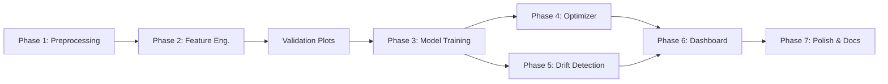

# AI-Based Model to Minimize C4 Slippage in Debutanizer

## Dataset Analysis Findings

### Overview
- **Dataset**: [9.DB DATA -B.xlsx](file:///c:/Users/KIIT/OneDrive/Desktop/DEBUTANIZER-model/9.DB%20DATA%20-B.xlsx) — 11,399 hourly rows (after removing 2 header rows)
- **Date Range**: April 2023 → April 2026 (~3 years)
- **Columns**: 8 process variables + 2 target outputs (C4H6 wt%, C4H8 wt%)
- **Sampling**: Hourly (1-hour median interval), only 2 gaps > 2 hours

### Data Columns

| Column | Tag ID | Unit | Description |
|--------|--------|------|-------------|
| Feed Flow | 1145FIC1101 | TPH | Feed flow to debutanizer |
| Reboiler Outlet Temp | 1150TI1107 | °C | Reboiler outlet temperature |
| Column Top Temp | 1150TI1202 | °C | Column top temperature |
| Reboiling Steam Flow | 1150FIC1101 | TPH | LP steam flow |
| Reflux Flow | 1150FIC1202 | TPH | Reflux flow |
| Column Top Pressure | 1150PIC1101 | kg/cm²g | Column top pressure |
| Column Bottom Temp | 1150TI1105 | °C | Column bottom temperature |
| Control Tray Temp | 1150TIC1101 | °C | Control tray temperature |
| **C4H6 in DB Bottom** | 1150AI14011F | Wt% | Butadiene slippage (target 1) |
| **C4H8 in DB Bottom** | 1150AI14011G | Wt% | Butylene slippage (target 2) |

### Target Variable: Total C4 Slippage (C4H6 + C4H8)

| Stat | Value |
|------|-------|
| Mean | 0.50 wt% |
| Median | 0.40 wt% |
| Std | 0.37 wt% |
| Min | 0.00007 wt% |
| Max | 2.75 wt% |
| **% exceeding 0.5 spec** | **39.9%** |
| % exceeding 1.0 | 10.9% |
| % exceeding 1.5 | 1.5% |

> [!IMPORTANT]
> Nearly **40% of the time**, the plant exceeds the 0.5 wt% spec — confirming the problem statement is real and significant.

---

### Critical Data Quality Issues Found

#### 1. 🚨 13-Month Data Gap (Missing Data, Not Shutdown)
- **Block 1**: Apr 2023 – Aug 2023 (5 months, ~3,288 rows)
- **GAP**: Sep 2023 – Aug 2024 (13 months — data not recorded/exported)
- **Block 2**: Sep 2024 – Nov 2024 (3 months, ~1,541 rows)
- **GAP**: Dec 2024 (missing)
- **Block 3**: Aug 2025 – Apr 2026 (9 months, ~6,514 rows)

> [!WARNING]
> Lag features must never cross block boundaries.

#### 2. Bimodal Distribution in Key Variables
- **Reboiler Outlet Temp**: 58% below 50°C, 42% above 107°C
- **Column Top Temp**: 41% below 50°C, 59% above 50°C
- Cause unknown. **No K-Means clustering** — tree models handle bimodal splits naturally via `if temp > threshold`. A scatter plot will be generated as a validation artifact to visually confirm whether true clusters exist.

#### 3. 🚨 Stuck Analyzer Readings
- **C4H6**: 42.7% repeats; max 889 consecutive identical readings (~37 days!)
- **C4H8**: 7.6% repeats; max 333 consecutive identical (~14 days)
- This is **the reason** we're building a soft sensor.

#### 4. Shutdowns & Outliers
- 56 all-zero rows removed (plant offline)
- Outliers capped at P1/P99 (not removed — process upsets carry information)

---

### What Drives High C4 Slippage?

| Variable | Low C4 (<0.3%) | High C4 (>0.8%) | Δ | Physical Interpretation |
|----------|---------------|-----------------|---|------------------------|
| Feed Flow | 80.3 TPH | 85.8 TPH | **+5.4** | Higher feed overwhelms separation |
| Reflux Flow | 92.8 TPH | 90.6 TPH | **-2.2** | Less reflux = poorer fractionation |
| Reboiling Steam | 21.2 TPH | 20.8 TPH | **-0.3** | Less energy = less stripping |
| Reboiler Outlet Temp | 66.2°C | 56.9°C | **-9.3** | Colder reboiler = insufficient vaporization |
| Column Top Pressure | 4.01 | 4.15 | **+0.14** | Higher pressure = harder separation |

> [!NOTE]
> **Steam and Reflux are highly correlated** (r = 0.88). Optimizer must handle this — they move together.

---

## Model Architecture: Two-Tier Strategy

> [!CAUTION]
> **Why NOT use lagged C4 as input in the production model?**
>
> IOCL is building this soft sensor because the analyzer is unreliable (stuck for 37 days), slow (12-min cycle), and lab results are delayed (2 hrs). If we use `C4_lag1` as a feature, we get amazing R² — but we've built a model that says *"tomorrow's C4 ≈ today's C4"*. The moment the analyzer freezes, our strongest feature becomes stale, and the model collapses.
>
> The production soft sensor must predict C4 **purely from process variables** — that's the whole point.

### Model Tier 1: Production Soft Sensor (Deployed)

**Purpose**: Replace/supplement the unreliable analyzer. Must work even when analyzer is frozen.

**Features (process-only)**:
- Current process variables: Feed, Steam, Reflux, Pressure, Temperatures
- Lagged **process** variables: `Steam_lag1..lag3`, `Reflux_lag1..lag3`, `Feed_lag1..lag3`, etc.
- Rolling stats: `Steam_rolling_mean_3h`, `Feed_rolling_std_6h`, etc.
- Engineered ratios: Reflux/Feed, Steam/Feed, Temp gradients
- Rate-of-change: `Steam_diff1`, `Reflux_diff1`, etc.
- Time features: hour, day_of_week, month (cyclical)
- **NO lagged C4 target values**

**Sub-models** (ensemble for Total C4):
- **Model A**: Predict C4H8 (reliable analyzer → all rows for training)
- **Model B**: Predict C4H6 (unreliable → trained only on non-stuck readings)
- **Total C4 = Model A + Model B**

### Model Tier 2: Research Model (Comparison Only)

**Purpose**: Show management the value of analyzer history when it's working.

**Features**: Everything from Tier 1 **plus** lagged C4 values (`C4H8_lag1..lag12`, `C4H6_lag1..lag3`)

**Expected outcome**:
```
Production Soft Sensor R² = ~0.85
Research Model R²          = ~0.93+
```

This comparison is extremely valuable for presentations:
- Proves the soft sensor works without the analyzer
- Quantifies exactly how much analyzer history helps
- Justifies investment in better analyzer hardware (if the gap is large)

---

## Model Constraints & Operating Limits

> [!CAUTION]
> The optimizer must **never** recommend values outside safe operating limits.

### Manipulable Variables (Optimizer Can Adjust)

| Variable | Unit | Hard Min | Rec. Min | Mean | Rec. Max | Hard Max | Max Δ/hr |
|----------|------|----------|----------|------|----------|----------|----------|
| Reboiling Steam Flow | TPH | 14.4 | 18.0 | 21.0 | 24.4 | 25.3 | ±2.0 |
| Reflux Flow | TPH | 70.4 | 80.0 | 91.1 | 103.9 | 105.7 | ±5.0 |

### Monitored Variables (Constraints)

| Variable | Unit | Hard Min | Rec. Min | Mean | Rec. Max | Hard Max | Trip/Alarm |
|----------|------|----------|----------|------|----------|----------|------------|
| Column Bottom Temp | °C | 99.0 | 102.6 | 107.0 | 111.5 | 113.0 | >115°C alarm |
| Control Tray Temp | °C | 57.2 | 59.1 | 71.6 | 89.7 | 91.3 | — |
| Column Top Pressure | kg/cm²g | 3.78 | 3.85 | 4.05 | 4.45 | 4.55 | >5.0 trip |
| Feed Flow | TPH | 44.6 | 65.4 | 83.3 | 95.3 | 99.3 | Disturbance |

### Rate-of-Change Constraints
```
Steam: max ±2.0 TPH/hr  (≈10% of mean, prevents thermal shock)
Reflux: max ±5.0 TPH/hr (≈5% of mean, prevents flooding/weeping)
```

Derived from the 95th percentile of actual hourly changes in the data.

---

## Resolved Questions

| Question | Resolution |
|----------|-----------|
| Target | Total C4 (C4H6 + C4H8) — Two-model ensemble |
| Cost formula | Placeholder: `Loss = max(0, C4 - 0.5) × Feed × 1000 × price_per_kg` |
| Data gap | Missing data export. Split into contiguous blocks |
| Operating regimes | Unknown cause. No K-Means — trees handle naturally |
| Constraints | Data-driven (P5-P95 / P1-P99) + refinery literature |

---

## Proposed Changes

### Phase 1: Data Preprocessing

#### [NEW] [data_preprocessing.py](file:///c:/Users/KIIT/OneDrive/Desktop/DEBUTANIZER-model/data_preprocessing.py)

1. Parse & rename columns
2. Remove 2 header rows + 56 shutdown rows
3. Detect stuck analyzer readings (runs of >12 identical C4H6 values) → mark with `C4H6_stuck` flag
4. Outlier capping at P1/P99
5. Label contiguous time blocks (Block 1/2/3)
6. Cyclical time features (hour, day_of_week, month via sin/cos)
7. Output: clean parquet file

---

### Phase 2: Feature Engineering

#### [NEW] [feature_engineering.py](file:///c:/Users/KIIT/OneDrive/Desktop/DEBUTANIZER-model/feature_engineering.py)

**Process-only features** (for Production Soft Sensor):

| Category | Features | Count |
|----------|----------|-------|
| Lagged process vars | `{var}_lag1..lag3` for 8 vars + `_lag6, _lag12` for slow vars | ~50 |
| Rolling stats | `{var}_rolling_mean_3h/6h/12h`, `_rolling_std_3h` | ~32 |
| Ratios | Reflux/Feed, Steam/Feed, Temp gradients, Reboiler delta | 4 |
| Rate-of-change | `{var}_diff1` for Steam, Reflux, Feed, Bottom Temp | 4 |
| Time | hour_sin, hour_cos, dow_sin, dow_cos, month_sin, month_cos | 6 |
| **Total** | | **~96** |

**Additional features for Research Model only**:
- `C4H8_lag1..lag12`, `C4H6_lag1..lag3` (~8 more features)

All lag/rolling features computed **within blocks only** — no cross-gap leakage.

---

### Phase 3: Model Training

#### [NEW] [model_training.py](file:///c:/Users/KIIT/OneDrive/Desktop/DEBUTANIZER-model/model_training.py)

**Architecture**:

```
PRODUCTION SOFT SENSOR (Tier 1)
─────────────────────────────────
Process features ──┬── Model A (XGBoost) ──► C4H8_pred ──┐
(~96 features)     │   (all rows)                        ├──► Total C4
                   └── Model B (XGBoost) ──► C4H6_pred ──┘
                       (non-stuck rows only)

RESEARCH MODEL (Tier 2)
─────────────────────────────────
Process + C4 lag ──┬── Model A+ ──► C4H8_pred ──┐
(~104 features)    │                             ├──► Total C4
                   └── Model B+ ──► C4H6_pred ──┘
```

**Training Strategy**:
1. **Block-aware split**: Block 1+2 train, Block 3 test
2. **Time-series CV**: Expanding window (no random K-fold)
3. **Hyperparameters**: Optuna Bayesian optimization over learning_rate, max_depth, n_estimators, colsample, subsample, reg_alpha, reg_lambda

**Performance Goals**:

| Metric | Goal | Notes |
|--------|------|-------|
| **Primary** | Beat naive lag-1 baseline (R² > 0.88) | If we can't beat "C4(t) = C4(t-1)" with process vars, the model has no value |
| **Stretch** | R² > 0.85 for Production Soft Sensor | Industrial datasets are messy — 0.85 is excellent |
| **Comparison** | Show gap: Soft Sensor R² vs Research Model R² | Quantifies analyzer value for management |

> [!IMPORTANT]
> **No hard R²/MAE promises.** Report actual performance honestly. Even R² = 0.80 with a process-only model is a significant achievement for an industrial soft sensor on noisy data.

**Feature Importance Validation (Physics Sanity Check)**:

After training, the top features must make physical sense:

| ✅ Good (physically meaningful) | ❌ Bad (artifacts) |
|--------------------------------|-------------------|
| Reflux_Ratio, Steam_Feed_Ratio | month_sin |
| Column_Top_Pressure | day_of_week_cos |
| Bottom_Temp, Reboiler_Outlet_Temp | hour_sin |
| Feed_Flow, Steam_lag1..lag3 | Random feature |

If nonsense features dominate top-10 importance:
1. Model is learning temporal artifacts, not physics
2. Investigate: are time features correlating with seasonal operating changes?
3. Consider removing time features and retraining
4. Add a **random noise column** during training — if it ranks high, model is overfitting

This validation will be a dedicated section in the dashboard and final report.

---

### Phase 4: Constrained Multi-Objective Optimizer

#### [NEW] [optimizer.py](file:///c:/Users/KIIT/OneDrive/Desktop/DEBUTANIZER-model/optimizer.py)

> [!WARNING]
> **Not just "minimize C4"** — that trivially recommends max steam + max reflux, which operators already know. The optimizer must balance C4 recovery against energy cost.

**Multi-objective formulation**:

```python
# Objective: minimize total operating cost
total_cost = (
    C4_loss_cost                          # ₹ lost from C4 slippage above spec
    + steam_cost                          # ₹ cost of LP steam consumed
    + reflux_energy_cost                  # ₹ cost of reflux pumping + condenser duty
)

# Where:
C4_loss_cost    = max(0, predicted_C4 - 0.5) * feed_flow * 1000 * C4_price_per_kg
steam_cost      = steam_flow * steam_price_per_ton
reflux_cost     = reflux_flow * reflux_energy_per_ton

# Subject to:
18.0 <= steam <= 24.4                    # Recommended range
80.0 <= reflux <= 103.9                  # Recommended range
|steam_new - steam_current| <= 2.0       # Rate constraint
|reflux_new - reflux_current| <= 5.0     # Rate constraint
predicted_bottom_temp <= 111.5           # Safety
predicted_pressure <= 4.45               # Safety
```

**Outputs**:
- Recommended setpoints (steam, reflux)
- Expected C4 reduction (wt%)
- Energy cost of the change (₹/hr)
- **Net savings** = C4 recovery value − additional energy cost
- Trade-off curve: "spend X more on steam → save Y on C4"

---

### Phase 5: Drift Detection & Monitoring

#### [NEW] [drift_detection.py](file:///c:/Users/KIIT/OneDrive/Desktop/DEBUTANIZER-model/drift_detection.py)

Since data spans 2023–2026, refinery conditions change (feed slate, catalyst aging, equipment fouling). A model trained on 2023 may degrade in 2026.

**Population Stability Index (PSI)** per feature across time blocks:

```
PSI < 0.1  → No drift (green)
PSI 0.1-0.2 → Moderate drift (yellow)  
PSI > 0.2  → Significant drift (red) → retrain recommended
```

**Implementation**:
1. Compute PSI for each feature: Block 1 vs Block 2, Block 2 vs Block 3
2. Flag features with PSI > 0.2
3. Track model residual distribution over time (are errors growing?)
4. Dashboard panel showing drift status per feature

**Dashboard integration**: A "Model Health" indicator showing:
- Feature drift status (per-feature PSI heatmap)
- Residual trend (is accuracy degrading over time?)
- Recommended action: "Model performing well" / "Consider retraining"

This becomes a strong **Future Scope** slide:
> *"When deployed live, PSI monitoring triggers automatic retraining when operating conditions drift beyond training distribution."*

---

### Phase 6: Streamlit Dashboard

#### [NEW] [app.py](file:///c:/Users/KIIT/OneDrive/Desktop/DEBUTANIZER-model/app.py)

**Tab 1: Live Prediction**
- Process value inputs (manual or CSV upload)
- C4 prediction gauge (green < 0.3, yellow 0.3-0.5, red > 0.5)
- Confidence display
- SHAP waterfall: "why is C4 high right now?"

**Tab 2: Actual vs Predicted Trends**
- Overlay chart: actual C4 (analyzer) vs predicted C4 (soft sensor)
- Residual plot over time
- Anomaly flag: when soft sensor ≠ analyzer → "analyzer may be stuck"
- **Tier 1 vs Tier 2 comparison chart** (shows value of soft sensor)

**Tab 3: Operator Recommendations**
- Current vs optimal operating point
- Recommended adjustments with constraint limits shown visually
- **Net savings calculator**: `C4 recovery savings − energy cost increase = net ₹/hr`
- "What-if" simulator: bounded sliders
- Constraint violation warnings

**Tab 4: Model Health & Analytics**
- **Feature importance ranking** with physics validation (✅/❌ markers)
- **Drift detection heatmap** (PSI per feature per time block)
- Monthly C4 trends
- PDF report generation

---

### Phase 7: Supporting Files

#### [MODIFY] [requirements.txt](file:///c:/Users/KIIT/OneDrive/Desktop/DEBUTANIZER-model/requirements.txt)
Add: `scikit-learn`, `optuna`, `shap`, `plotly`, `joblib`, `scipy`

#### [NEW] [config.py](file:///c:/Users/KIIT/OneDrive/Desktop/DEBUTANIZER-model/config.py)
- Column mappings and tag IDs
- Operating constraints table (hard limits, recommended ranges, rate limits)
- Cost parameters (C4 price, steam price, reflux energy cost)
- Model hyperparameters
- PSI drift thresholds

#### [DELETE] [analyze_data.py](file:///c:/Users/KIIT/OneDrive/Desktop/DEBUTANIZER-model/analyze_data.py)
#### [DELETE] [analyze_constraints.py](file:///c:/Users/KIIT/OneDrive/Desktop/DEBUTANIZER-model/analyze_constraints.py)
Temporary analysis scripts — findings captured in this document.

---

## Exploratory Validation Steps (Before Model Training)

Before committing to the model architecture, generate these diagnostic plots:

1. **Regime scatter plot**: `Reboiler_Outlet_Temp vs Column_Top_Temp`, colored by Total_C4
   - If clear clusters exist → add regime feature
   - If gradient/continuous → skip clustering, let trees handle it

2. **Random noise feature test**: Add a random column during training
   - If it ranks in top-20 importance → model is overfitting
   - If bottom → model is learning real signal

3. **Block consistency check**: Train on Block 1 alone, test on Block 2 and Block 3
   - If performance drops heavily → significant drift between periods

---

## Verification Plan

### Automated Tests
1. **Preprocessing**: No NaN/inf, correct row count, dtypes
2. **Feature engineering**: Lag features aligned correctly, no look-ahead bias, no cross-block leakage
3. **Model performance**: Beat naive lag-1 baseline; report honest metrics
4. **Feature importance**: Top-10 features pass physics sanity check
5. **Constraint enforcement**: Optimizer never recommends outside hard limits
6. **Drift detection**: PSI computed correctly across all blocks

### Manual Verification
- Upload original Excel → verify predictions visually match trends
- Test what-if simulator with known scenarios
- Verify constraint warnings trigger near limits
- Review feature importance for physical plausibility
- Generate PDF report

---

## Execution Order



Estimated effort: ~5-7 hours total.
