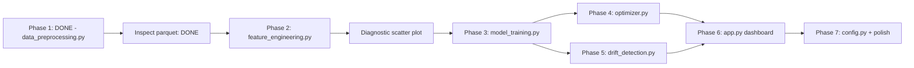

# Debutanizer C4 Slippage Model - Implementation Plan

---

## STATUS: Phase 1 Complete

**Output**: `data/clean_data.parquet` — 11,343 rows x 23 columns  
**Audit scripts**: `notebooks/analyze_data.py`, `notebooks/analyze_constraints.py`

---

## Phase 1 Findings: What the Clean Data Actually Shows

These findings come from running `notebooks/inspect_clean_data.py` against the parquet output.
They update and replace some assumptions made during planning.

### F1. There Are 4 Data Blocks, Not 3

The gap structure is more complex than anticipated:

| Block | Start | End | Rows | Duration |
|-------|-------|-----|------|----------|
| 1 | 2023-04-16 | 2023-08-31 | 3,288 | 137 days |
| — | **Gap: 376 days** | — | — | — |
| 2 | 2024-09-11 | 2024-10-11 | 738 | 30.7 days |
| — | **Gap: ~43 hours** | — | — | — |
| 3 | 2024-10-13 | 2024-11-15 | 803 | 33.4 days |
| — | **Gap: 258 days** | — | — | — |
| 4 | 2025-08-01 | 2026-04-30 | 6,514 | 272 days |

Blocks 2 and 3 are separated by only 43 hours — they were originally treated as one "Block 2" but the gap exceeds the 24h threshold. They likely represent the same operating campaign. **Decision needed**: treat Blocks 2+3 as one campaign or keep separate. For lag computation, they must stay separate (43h gap = 43 missing lag rows).

> [!NOTE]
> Block 4 has 2 non-1h gaps (max 10 hours) within it. These are minor data dropouts, not campaign boundaries. Lag features around those 2 points will be NaN-padded and excluded from training.

### F2. The Bimodal Temperature Split is Entirely Block-Driven

This is the single most important finding from the inspection.

| Block | Reboiler Temp (mean) | Regime |
|-------|---------------------|--------|
| 1 | 35.9°C | **100% cold** (below 50°C) |
| 2 | 108.0°C | **100% hot** (above 50°C) |
| 3 | 93.2°C | Mixed (15% cold, 85% hot) |
| 4 | 71.7°C | Mixed (~49% cold, ~51% hot) |

**Block 1 is entirely in the cold reboiler regime. Block 2 is entirely in the hot regime.**

This means the "bimodal distribution" is not two concurrent operating modes — it is the difference between *operating periods*. The column was running differently in 2023 than in 2024-2026 (possibly different feed composition, different season, or equipment changes).

**Implications**:
1. **No K-Means needed** — regime is essentially captured by the block label or the actual temperature values. The tree model will learn `if Reboiler_Outlet_Temp < 50` as a natural split, which is the right behaviour.
2. The `Data_Block` label itself carries regime information and should be included as a categorical feature in the model.
3. C4 slippage between cold and hot regimes is nearly identical (cold: 0.52 wt%, hot: 0.46 wt%), so the regime is not a strong predictor of C4 level on its own — but it may interact with other variables in ways the tree will capture.

### F3. C4H6 Analyzer Often Freezes at Zero — This Is Not a Valid Value

During stuck periods, the C4H6 analyzer statistics are:

```
C4H6 STUCK periods:  mean=0.010, median=0.000, P75=0.000
C4H6 NORMAL periods: mean=0.072, median=0.009, P75=0.081
```

The median stuck value is **exactly 0.000**. When the C4H6 analyzer freezes, it usually freezes at or near zero — meaning it is **not** reporting a real low-C4H6 condition, it is reporting nothing. This is critical for Model B:

- **Original plan**: Train Model B (C4H6 predictor) on non-stuck rows only
- **Refined**: Additionally check that C4H6 training rows have `C4H6_Bottom > 0.001` (exclude frozen-at-zero readings). There are rows where the analyzer reads zero and is not flagged as stuck (because the run length is < 12). These zeros may still be invalid.
- **Practical impact**: Model B's training set will be significantly smaller (~4,000-5,000 rows). This is acceptable; XGBoost handles this well.

### F4. C4H8 Stuck Readings Cluster at Two Extreme Values

During C4H8 stuck periods:
```
C4H8 STUCK periods: mean=0.603, P25=0.034, P50=0.034, P75=1.262
```

The 25th and 50th percentiles are 0.034, but the 75th is 1.262 — indicating the analyzer freezes at two very different levels: near its minimum and near its maximum. This is unusual. It suggests the C4H8 analyzer sometimes gets stuck reporting a false-high just as often as a false-low.

**Implication for Model A (C4H8 predictor)**: The 7.9% stuck C4H8 rows are not uniformly distributed in value space. If we train on all rows including stuck, we are teaching the model that some process conditions correspond to extreme-high or extreme-low C4H8 when they may not. Consider also filtering out C4H8 stuck rows from Model A training (not just the target but the label noise). Use the `C4H8_Bottom_stuck` flag.

### F5. Block 1 Has Significantly Higher C4 Slippage Than Later Blocks

| Block | Mean Total_C4 | % Above 0.5 spec |
|-------|--------------|-----------------|
| **1** | **0.602** | **59.6%** |
| 2 | 0.337 | 17.3% |
| 3 | 0.330 | 19.9% |
| 4 | 0.482 | 34.9% |

Block 1 has 60% of readings above spec — nearly double Block 4's rate. This is the earliest data (2023). Either the column was being operated more poorly in 2023, or the operating conditions were genuinely harder (higher feed, lower steam/reflux ratios).

Checking the per-block process stats:
- Block 1 Feed_Flow mean: **85.8 TPH** vs Block 4: **78.6 TPH** — Block 1 was running higher throughput
- Block 1 Reflux_Flow mean: **95.7 TPH** vs Blocks 2/3: **102.2 / 101.9 TPH** — lower reflux in Block 1
- Block 1 Reboiling_Steam mean: **21.3 TPH** vs Blocks 2/3: **23.8 / 24.3 TPH** — significantly less steam

**This physically explains the higher slippage in Block 1**: more feed, less steam, less reflux = worse separation. The model should learn this pattern from the data.

**Implication for train/test split**: We had planned Block 1+2 train, Block 4 test. Given that Block 1 has systematically different operating conditions *and* different C4 behavior, keeping it in training is correct — it gives the model exposure to high-slippage operating conditions that Block 4 also shows 35% of the time.

### F6. Winsorisation Clipped Exactly 114 Rows Per Column

Every single column had exactly 114 rows clipped (57 at the low end for some, 57 at the high end for others, or 114 at one end and 0 at the other). This is unlikely to be a coincidence. These 114 rows are likely the **same rows** — a cluster of process upsets or abnormal operating periods that manifest as extreme values across all variables simultaneously.

**Action for feature engineering**: Flag these 114 rows as `is_extreme_event = True`. Check whether C4 slippage during these periods is systematically different. If these are real upset events, the model needs to learn from them; if they are sensor errors, they should be excluded.

### F7. Sampling Is Perfect Within Blocks (With 2 Minor Exceptions)

- Blocks 1, 2, 3: **zero** non-1h intervals — perfectly regular hourly data
- Block 4: **2 gaps** of up to 10 hours

The 2 gaps in Block 4 are manageable. Lag features touching those gaps will be NaN and excluded during training (standard time-series treatment).

---

## Model Constraints & Operating Limits

> [!CAUTION]
> The optimizer must **never** recommend values outside safe operating limits. Safety constraints are **absolute ceilings** — they override the optimization objective.

### Safety Ceilings (Hard-Coded, Non-Negotiable)

| Variable | Safety Ceiling | Consequence If Exceeded |
|----------|---------------|-------------------------|
| **Column Bottom Temp** | **<= 115 degC** | Alarm / potential shutdown |
| **Column Top Pressure** | **<= 5.0 kg/cm2g** | Pressure trip / emergency depressuring |

```python
# Hard-coded in optimizer - NOT configurable, NOT overridable
SAFETY_CEILINGS = {
    'Column_Bottom_Temp': 115.0,   # degC - absolute max, alarm threshold
    'Column_Top_Pressure': 5.0,    # kg/cm2g - trip threshold
}
```

### Manipulable Variables (Optimizer Can Adjust)

| Variable | Unit | Hard Min | Rec. Min | Mean | Rec. Max | Hard Max | Max d/hr |
|----------|------|----------|----------|------|----------|----------|----------|
| Reboiling Steam Flow | TPH | 14.4 | 18.0 | 21.0 | 24.4 | 25.3 | +/-2.0 |
| Reflux Flow | TPH | 70.4 | 80.0 | 91.1 | 103.9 | 105.7 | +/-5.0 |

### Monitored Variables (Optimization Constraints)

| Variable | Unit | Rec. Min | Mean | Rec. Max | Safety Ceiling |
|----------|------|----------|------|----------|----------------|
| Column Bottom Temp | degC | 102.6 | 107.0 | 111.5 | **115.0 (absolute)** |
| Control Tray Temp | degC | 59.1 | 71.6 | 89.7 | -- |
| Column Top Pressure | kg/cm2g | 3.85 | 4.05 | 4.45 | **5.0 (absolute)** |

### Clarification Needed: "+/-50%" Constraint

> [!WARNING]
> Stakeholders mentioned "plus or minus 50%" for model recommendations. Three possible interpretations:
>
> | Interpretation | Steam Example (current = 21 TPH) | Effective Range |
> |---------------|----------------------------------|----------------|
> | +/-50% of **current value** | 21 +/- 10.5 | 10.5 - 31.5 TPH |
> | +/-50% of **operating range** (18-24.4) | midpoint +/- 3.2 | 17.9 - 24.3 TPH |
> | +/-50% of **mean** | 21 +/- 10.5 | 10.5 - 31.5 TPH |
>
> **Current implementation**: Data-derived P5-P95 ranges with +/-2 TPH/hr rate limit. Confirm with IOCL which interpretation is intended.

---

## Phase 2 Plan: Feature Engineering

### What Changes From the Original Plan Based on Findings

| Original assumption | Actual finding | Adjustment |
|--------------------|-----------------|-|
| 3 data blocks | 4 blocks (Blocks 2+3 are 43h apart) | Treat all 4 as separate for lag computation; optionally merge 2+3 for train/test split |
| Bimodal regime = two concurrent modes | Regime is block-specific (Block 1 = all cold, Block 2 = all hot) | No K-Means; include `Data_Block` as categorical feature |
| Model B: exclude stuck C4H6 rows | C4H6 freezes at zero — also exclude near-zero readings even if not flagged stuck | Add `C4H6_Bottom > 0.001` filter to Model B training set |
| Model A: train on all rows | C4H8 stuck readings cluster at 0.034 AND 1.26 (both extremes) | Also exclude stuck rows from Model A training labels |
| 114 extreme-event rows from winsorisation | Same 114 rows across all columns — likely a coordinated upset event | Flag as `is_extreme_event`; analyze separately before deciding to include/exclude |

### Feature Categories

#### A. Core Process Variables (current timestep — 8 features)
```
Feed_Flow, Reboiler_Outlet_Temp, Column_Top_Temp, Reboiling_Steam_Flow,
Reflux_Flow, Column_Top_Pressure, Column_Bottom_Temp, Control_Tray_Temp
```

#### B. Lagged Process Variables (computed within-block only)
Lag windows driven by physical response times:

| Variable | Lags | Reason |
|----------|------|--------|
| Reboiling_Steam_Flow | 1, 2, 3, 6, 12 | Slow thermal response, dominant manipulable |
| Reflux_Flow | 1, 2, 3, 6 | Hydraulic response, fast-ish |
| Feed_Flow | 1, 2, 3 | Disturbance variable — fast propagation |
| Column_Bottom_Temp | 1, 2, 3 | Direct indicator of separation |
| Control_Tray_Temp | 1, 2, 3, 6 | Cascade controller setpoint proxy |
| Reboiler_Outlet_Temp | 1, 2, 3 | Thermal state indicator |
| Column_Top_Temp | 1, 2 | Fast-responding |
| Column_Top_Pressure | 1, 2 | Fast-responding |

**Total lagged features: ~32**

#### C. Rolling Statistics (within-block only)
```
Rolling mean: Steam, Reflux, Feed, Bottom_Temp  x  [3h, 6h, 12h]  = 12 features
Rolling std:  Steam, Reflux, Feed                x  [3h, 6h]       = 6 features
```
Rolling std of Steam and Reflux captures *instability* — erratic adjustments correlate with poor separation.

**Total rolling features: ~18**

#### D. Engineered Ratios
```
Reflux_Ratio       = Reflux_Flow / Feed_Flow          (separation intensity per unit feed)
Steam_Feed_Ratio   = Reboiling_Steam_Flow / Feed_Flow (energy per unit feed)
Temp_Gradient      = Column_Bottom_Temp - Column_Top_Temp
Reboiler_Delta     = Reboiler_Outlet_Temp - Column_Bottom_Temp
```

**Total ratio features: 4**

#### E. Rate-of-Change (delta over 1 hour)
```
Steam_diff1        = Steam(t) - Steam(t-1)
Reflux_diff1       = Reflux(t) - Reflux(t-1)
Feed_diff1         = Feed(t) - Feed(t-1)
Bottom_Temp_diff1  = Bottom_Temp(t) - Bottom_Temp(t-1)
```

**Total diff features: 4**

#### F. Time Features (cyclical — already in parquet)
```
hour_sin, hour_cos, dow_sin, dow_cos, month_sin, month_cos
```

#### G. Block / Regime Feature
```
Data_Block (categorical: 1, 2, 3, 4)
```
XGBoost can use this directly. No one-hot encoding needed.

#### H. Metadata Flags (NOT model features — used for row filtering)
```
C4H6_Bottom_stuck     -> exclude from Model B training
C4H8_Bottom_stuck     -> exclude from Model A training
hours_since_*_change  -> used by analyzer health dashboard indicator
is_extreme_event      -> analyze separately; decide include/exclude
```

### Total Feature Count (Production Soft Sensor — Tier 1)
| Category | Count |
|----------|-------|
| Core process vars | 8 |
| Lagged process vars | ~32 |
| Rolling stats | ~18 |
| Engineered ratios | 4 |
| Rate-of-change | 4 |
| Time (cyclical) | 6 |
| Block label | 1 |
| **Total** | **~73** |

Research Model (Tier 2) adds lagged C4H8 (lag 1-12) and C4H6 (lag 1-3) = **~88 features**.

### Training Set Construction

| Model | Training rows (after filters) | Test rows |
|-------|-------------------------------|-----------|
| Model A (C4H8) | Blocks 1+2+3, exclude C4H8_stuck (~10,000) | Block 4 (~6,500) |
| Model B (C4H6) | Blocks 1+2+3, exclude C4H6_stuck AND C4H6 < 0.001 (~3,500-4,500) | Block 4 non-stuck only |

> [!WARNING]
> Model B has a much smaller valid training set. Monitor for overfitting carefully — use stronger regularization (higher `reg_alpha`, `reg_lambda`) than Model A.

### Pre-Training Diagnostic Plot
Before training, generate one scatter plot:
```
x = Reboiler_Outlet_Temp
y = Column_Top_Temp
color = Total_C4 (binned: low / medium / high)
```
This confirms whether the block-driven regimes also correspond to different C4 behavior, or whether C4 varies continuously across the temperature space. The answer determines whether `Data_Block` needs any special treatment in the model.

---

## Model Architecture: Two-Tier Strategy

> [!CAUTION]
> **Why NOT use lagged C4 as input in the production model?**
>
> IOCL is building this soft sensor because the analyzer is unreliable (stuck for 37 days), slow (12-min cycle), and lab results are delayed (2 hrs). If we use `C4_lag1` as a feature, we get amazing R2 but built a model that says "tomorrow's C4 = today's C4". The moment the analyzer freezes, our strongest feature becomes stale, and the model collapses.
>
> The production soft sensor must predict C4 **purely from process variables** -- that's the whole point.

### Model Tier 1: Production Soft Sensor
- Features: ~73 process-only features
- Sub-models: Model A (C4H8) + Model B (C4H6)
- Total C4 = Model A output + Model B output

### Model Tier 2: Research Model (Comparison Only)
- Features: ~88 (Tier 1 + lagged C4 values)
- Expected comparison: Soft Sensor R2 ~0.85, Research R2 ~0.93+
- Demonstrates value of reliable analyzer to management

---

## Performance Goals

| Metric | Goal | Notes |
|--------|------|-------|
| **Primary** | Beat naive lag-1 baseline | If we can't beat "C4(t) = C4(t-1)" with process vars, the model has no value |
| **Stretch** | R2 > 0.85 for Production Soft Sensor | Industrial datasets are messy -- 0.85 is excellent |
| **Comparison** | Show gap: Soft Sensor R2 vs Research Model R2 | Quantifies analyzer value for management |

> [!IMPORTANT]
> **No hard R2/MAE promises.** Even R2 = 0.80 with a process-only model is significant. Report honest metrics.

---

## Execution Order



---

## File Inventory

| File | Purpose | Status |
|------|---------|--------|
| `data_preprocessing.py` | Phase 1 pipeline | Done |
| `data/clean_data.parquet` | Clean output | Done |
| `notebooks/analyze_data.py` | Audit: lag/stuck/correlation analysis | Preserved |
| `notebooks/analyze_constraints.py` | Audit: operating limits derivation | Preserved |
| `notebooks/inspect_clean_data.py` | Audit: post-preprocessing inspection | Done |
| `feature_engineering.py` | Phase 2 | Next |
| `model_training.py` | Phase 3 | Pending |
| `optimizer.py` | Phase 4 | Pending |
| `drift_detection.py` | Phase 5 | Pending |
| `app.py` | Phase 6 dashboard | Pending |
| `config.py` | Central config + constraints | Pending |
