# Debutanizer C4 Slippage Model - Implementation Plan

---

## STATUS: Phase 1 Locked

**Output**: `data/clean_data.parquet` — 11,343 rows x **24 columns** (final, no further changes)
**Audit scripts**: `notebooks/analyze_data.py`, `notebooks/analyze_constraints.py`, `notebooks/inspect_clean_data.py`

> [!NOTE]
> Phase 1 is closed. Three bugs were fixed after the initial run (see F8). The parquet is the ground truth for all downstream work.

---

## Phase 1 Findings: What the Clean Data Actually Shows

These findings come from running `notebooks/inspect_clean_data.py` against the parquet output.
They update and replace some assumptions made during planning.

### F1. There Are 4 Data Blocks, Not 3

The gap structure is more complex than anticipated:

| Block | Start | End | Rows | Duration |
|-------|-------|-----|------|----------|
| 1 | 2023-04-16 | 2023-08-31 | 3,288 | 137 days |
| — | **Gap: 376 days** | — | — | — |
| 2 | 2024-09-11 | 2024-10-11 | 738 | 30.7 days |
| — | **Gap: ~43 hours** | — | — | — |
| 3 | 2024-10-13 | 2024-11-15 | 803 | 33.4 days |
| — | **Gap: 258 days** | — | — | — |
| 4 | 2025-08-01 | 2026-04-30 | 6,514 | 272 days |

Blocks 2 and 3 are separated by only 43 hours — they were originally treated as one "Block 2" but the gap exceeds the 24h threshold. They likely represent the same operating campaign. **Decision needed**: treat Blocks 2+3 as one campaign or keep separate. For lag computation, they must stay separate (43h gap = 43 missing lag rows).

> [!NOTE]
> Block 4 has 2 non-1h gaps (max 10 hours) within it. These are minor data dropouts, not campaign boundaries. Lag features around those 2 points will be NaN-padded and excluded from training.

### F2. The Bimodal Temperature Split is Entirely Block-Driven

This is the single most important finding from the inspection.

| Block | Reboiler Temp (mean) | Regime |
|-------|---------------------|--------|
| 1 | 35.9°C | **100% cold** (below 50°C) |
| 2 | 108.0°C | **100% hot** (above 50°C) |
| 3 | 93.2°C | Mixed (15% cold, 85% hot) |
| 4 | 71.7°C | Mixed (~49% cold, ~51% hot) |

**Block 1 is entirely in the cold reboiler regime. Block 2 is entirely in the hot regime.**

This means the "bimodal distribution" is not two concurrent operating modes — it is the difference between *operating periods*. The column was running differently in 2023 than in 2024-2026 (possibly different feed composition, different season, or equipment changes).

**Implications**:
1. **No K-Means needed** — regime is essentially captured by the block label or the actual temperature values. The tree model will learn `if Reboiler_Outlet_Temp < 50` as a natural split, which is the right behaviour.
2. The `Data_Block` label itself carries regime information and should be included as a categorical feature in the model.
3. C4 slippage between cold and hot regimes is nearly identical (cold: 0.52 wt%, hot: 0.46 wt%), so the regime is not a strong predictor of C4 level on its own — but it may interact with other variables in ways the tree will capture.

### F3. C4H6 Analyzer Often Freezes at Zero — This Is Not a Valid Value

During stuck periods, the C4H6 analyzer statistics are:

```
C4H6 STUCK periods:  mean=0.010, median=0.000, P75=0.000
C4H6 NORMAL periods: mean=0.072, median=0.009, P75=0.081
```

The median stuck value is **exactly 0.000**. When the C4H6 analyzer freezes, it usually freezes at or near zero — meaning it is **not** reporting a real low-C4H6 condition, it is reporting nothing. This is critical for Model B:

- **Original plan**: Train Model B (C4H6 predictor) on non-stuck rows only
- **Refined**: Additionally check that C4H6 training rows have `C4H6_Bottom > 0.001` (exclude frozen-at-zero readings). There are rows where the analyzer reads zero and is not flagged as stuck (because the run length is < 12). These zeros may still be invalid.
- **Practical impact**: Model B's training set will be significantly smaller (~4,000-5,000 rows). This is acceptable; XGBoost handles this well.

### F4. C4H8 Stuck Readings Cluster at Two Extreme Values

During C4H8 stuck periods:
```
C4H8 STUCK periods: mean=0.603, P25=0.034, P50=0.034, P75=1.262
```

The 25th and 50th percentiles are 0.034, but the 75th is 1.262 — indicating the analyzer freezes at two very different levels: near its minimum and near its maximum. This is unusual. It suggests the C4H8 analyzer sometimes gets stuck reporting a false-high just as often as a false-low.

**Implication for Model A (C4H8 predictor)**: The 7.9% stuck C4H8 rows are not uniformly distributed in value space. If we train on all rows including stuck, we are teaching the model that some process conditions correspond to extreme-high or extreme-low C4H8 when they may not. Consider also filtering out C4H8 stuck rows from Model A training (not just the target but the label noise). Use the `C4H8_Bottom_stuck` flag.

### F5. Block 1 Has Significantly Higher C4 Slippage Than Later Blocks

| Block | Mean Total_C4 | % Above 0.5 spec |
|-------|--------------|-----------------|
| **1** | **0.602** | **59.6%** |
| 2 | 0.337 | 17.3% |
| 3 | 0.330 | 19.9% |
| 4 | 0.482 | 34.9% |

Block 1 has 60% of readings above spec — nearly double Block 4's rate. This is the earliest data (2023). Either the column was being operated more poorly in 2023, or the operating conditions were genuinely harder (higher feed, lower steam/reflux ratios).

Checking the per-block process stats:
- Block 1 Feed_Flow mean: **85.8 TPH** vs Block 4: **78.6 TPH** — Block 1 was running higher throughput
- Block 1 Reflux_Flow mean: **95.7 TPH** vs Blocks 2/3: **102.2 / 101.9 TPH** — lower reflux in Block 1
- Block 1 Reboiling_Steam mean: **21.3 TPH** vs Blocks 2/3: **23.8 / 24.3 TPH** — significantly less steam

**This physically explains the higher slippage in Block 1**: more feed, less steam, less reflux = worse separation. The model should learn this pattern from the data.

**Implication for train/test split**: We had planned Block 1+2 train, Block 4 test. Given that Block 1 has systematically different operating conditions *and* different C4 behavior, keeping it in training is correct — it gives the model exposure to high-slippage operating conditions that Block 4 also shows 35% of the time.

### F6. Winsorisation Clipped Exactly 114 Rows Per Column

Every single column had exactly 114 rows clipped (57 at the low end for some, 57 at the high end for others, or 114 at one end and 0 at the other). This is unlikely to be a coincidence. These 114 rows are likely the **same rows** — a cluster of process upsets or abnormal operating periods that manifest as extreme values across all variables simultaneously.

**Action for feature engineering**: Flag these 114 rows as `is_extreme_event = True`. Check whether C4 slippage during these periods is systematically different. If these are real upset events, the model needs to learn from them; if they are sensor errors, they should be excluded.

### F7. Sampling Is Perfect Within Blocks (With 2 Minor Exceptions)

- Blocks 1, 2, 3: **zero** non-1h intervals — perfectly regular hourly data
- Block 4: **2 gaps** of up to 10 hours

The 2 gaps in Block 4 are manageable. Lag features touching those gaps will be NaN and excluded during training (standard time-series treatment).

### F8. Three Bugs Fixed After Initial Run — Final Parquet Has 24 Columns

After the first clean run was inspected, three issues were identified and fixed before Phase 1 was locked.

**Bug 1 — Floating-point equality in stuck detection (real bug, not style):**
The original `series.diff().eq(0)` misses cases where a historian (Exaquantum, OSI PI) writes the same reading with tiny floating-point noise — e.g., `0.07980082929134369` vs `0.0798008292913436`. Replaced with `np.isclose()` using a relative tolerance of `1e-6`.

Impact measured: C4H6 stuck count increased from **4,125 → 4,140 rows** (+15 rows that were being silently missed). Small but real.

**Bug 2 — Exact-zero shutdown detection:**
The original `== 0` comparison misses soft shutdowns where historian writes `0.001` during ramp-down. Replaced with `< SHUTDOWN_THRESHOLD` (currently 0.5 TPH/degC).

Impact on this dataset: still **56 rows removed** (confirming those rows were hard zeros). The fix future-proofs against different historian export settings.

**Addition — `Analyzer_Health` categorical column:**
Derived from `max(hours_since_C4H6_change, hours_since_C4H8_change)` and bucketed:

| Status | Threshold | Rows | % of dataset |
|--------|-----------|------|--------------|
| GOOD | Both changed within 12h | 7,928 | **69.9%** |
| WARNING | At least one unchanged 12-24h | 579 | 5.1% |
| BAD | At least one unchanged >24h | 2,836 | **25.0%** |

**25% of the dataset has at least one analyzer in BAD state.** This is immediately useful to operators as a standalone indicator on the dashboard, independent of C4 prediction. Costs nothing to compute since `hours_since_*` is already produced by stuck detection.

---

## Model Constraints & Operating Limits

> [!CAUTION]
> The optimizer must **never** recommend values outside safe operating limits. Safety constraints are **absolute ceilings** — they override the optimization objective.

### Safety Ceilings (Hard-Coded, Non-Negotiable)

| Variable | Safety Ceiling | Consequence If Exceeded |
|----------|---------------|-------------------------|
| **Column Bottom Temp** | **<= 115 degC** | Alarm / potential shutdown |
| **Column Top Pressure** | **<= 5.0 kg/cm2g** | Pressure trip / emergency depressuring |

```python
# Hard-coded in optimizer - NOT configurable, NOT overridable
SAFETY_CEILINGS = {
    'Column_Bottom_Temp': 115.0,   # degC - absolute max, alarm threshold
    'Column_Top_Pressure': 5.0,    # kg/cm2g - trip threshold
}
```

### Manipulable Variables (Optimizer Can Adjust)

| Variable | Unit | Hard Min | Rec. Min | Mean | Rec. Max | Hard Max | Max d/hr |
|----------|------|----------|----------|------|----------|----------|----------|
| Reboiling Steam Flow | TPH | 14.4 | 18.0 | 21.0 | 24.4 | 25.3 | +/-2.0 |
| Reflux Flow | TPH | 70.4 | 80.0 | 91.1 | 103.9 | 105.7 | +/-5.0 |

### Monitored Variables (Optimization Constraints)

| Variable | Unit | Rec. Min | Mean | Rec. Max | Safety Ceiling |
|----------|------|----------|------|----------|----------------|
| Column Bottom Temp | degC | 102.6 | 107.0 | 111.5 | **115.0 (absolute)** |
| Control Tray Temp | degC | 59.1 | 71.6 | 89.7 | -- |
| Column Top Pressure | kg/cm2g | 3.85 | 4.05 | 4.45 | **5.0 (absolute)** |

### Clarification Needed: "+/-50%" Constraint

> [!WARNING]
> Stakeholders mentioned "plus or minus 50%" for model recommendations. Three possible interpretations:
>
> | Interpretation | Steam Example (current = 21 TPH) | Effective Range |
> |---------------|----------------------------------|----------------|
> | +/-50% of **current value** | 21 +/- 10.5 | 10.5 - 31.5 TPH |
> | +/-50% of **operating range** (18-24.4) | midpoint +/- 3.2 | 17.9 - 24.3 TPH |
> | +/-50% of **mean** | 21 +/- 10.5 | 10.5 - 31.5 TPH |
>
> **Current implementation**: Data-derived P5-P95 ranges with +/-2 TPH/hr rate limit. Confirm with IOCL which interpretation is intended.

---

## STATUS: Phase 2 Locked

**Output**: `data/features.parquet` — 11,343 rows × **92 columns** (final, no further changes)
**Audit scripts**: `notebooks/analyze_phase2.py`, `notebooks/verify_features.py`, `notebooks/check_extreme_rows.py`

> [!NOTE]
> Phase 2 is closed. Feature set verified: no block leakage, 664 NaN cells all at block boundaries (correct), extreme events flagged correctly.

---

## Phase 2 Findings: What Feature Engineering Revealed

### F9. Extreme Events Are 1,392 Rows — Not 114

The plan said "114 winsorised rows" because the per-tail, per-column clip count is 114. But 114 is not the number of unique rows affected — it is the count per tail per column. Because each column clips different rows at each tail, the union of all clipped rows is **1,392 rows (12.3% of the dataset)**.

| Block | Extreme Events | % of Block |
|-------|---------------|------------|
| 1     | 480           | 14.6%      |
| 2     | 237           | **32.1%**  |
| 3     | 209           | **26.0%**  |
| 4     | 466           | 7.2%       |

**Key observations:**
- Blocks 2 and 3 have a disproportionately high extreme-event rate (32% and 26%) despite being the shortest blocks. This may indicate the plant was in a transitional or unstable operating period after the 376-day gap in 2024.
- C4 during extreme events: mean **0.622 wt%** (vs. 0.479 for normal rows) — extreme events have ~30% higher C4 on average.
- 47.7% of extreme-event rows exceed the 0.5 spec limit vs. 38.8% for normal rows.
- Extreme events are spread across all 4 blocks (not concentrated in one block), so they likely represent real process upsets, not sensor errors.

**Decision: Keep all 1,392 extreme-event rows in training.** The model needs to learn behaviour at operating boundaries. The `is_extreme_event` flag is preserved for post-hoc analysis and potential sample-weighting experiments.

### F10. Temp_Gradient is Bimodal — It is a Regime Indicator, Not a Continuous Feature

The `Temp_Gradient = Column_Bottom_Temp − Column_Top_Temp` has a striking bimodal distribution:

```
P50: -0.112   (near-zero — cold regime, Bottom ≈ Top)
P60: 64.334   (large positive — hot regime, Bottom >> Top)
```

P40 is -0.26, P60 is 64.3 — the entire middle 20% of the distribution jumps 64°C. This is because:
- **Block 1 (cold)**: Temp_Gradient mean = **-0.39°C** (bottom and top nearly equal — column not fully operational)
- **Block 2 (hot)**: Temp_Gradient mean = **+70.21°C** (normal fractionation — large thermal gradient)

This means Temp_Gradient provides very strong regime information for the tree model, but is essentially a restatement of `Data_Block` for Blocks 1 and 2. XGBoost will handle this via natural splits, but it's worth knowing the feature is not continuously informative.

Similarly, **Reboiler_Delta** (Reboiler_Outlet_Temp − Column_Bottom_Temp):
- Block 1: mean **-70.46°C** (reboiler outlet much colder than column bottom — abnormal)
- Block 2: mean **-0.30°C** (reboiler outlet ≈ column bottom — normal tight control)

This extreme regime difference across blocks further confirms that `Data_Block` is the single most important splitting feature for the tree.

### F11. Strongest Correlations With Total_C4 Come From Ratios, Not Raw Variables

Linear (Pearson) correlations of Tier 1 features with `Total_C4`:

| Feature | Abs. Correlation |
|---------|------------------|
| `Steam_Feed_Ratio` | **0.3239** |
| `Reflux_Ratio` | **0.2847** |
| `Column_Top_Pressure` | 0.2422 |
| `Feed_Flow` | 0.2146 |
| `Reflux_Flow` | 0.0989 |
| `Reboiler_Outlet_Temp` | 0.0634 |
| `Column_Bottom_Temp` | 0.0181 |

**Key insight:** The two engineered ratios (`Steam_Feed_Ratio`, `Reflux_Ratio`) are the strongest linear predictors — stronger than any raw variable. This validates the feature engineering decision. Raw `Reboiling_Steam_Flow` has correlation 0.055 but `Steam_Feed_Ratio` has 0.324 — a **6× improvement** from normalising by feed.

However, linear correlations understate tree model performance. XGBoost will use the lags and rolling stats in non-linear combinations. Expect the model's effective signal to be significantly higher than 0.32.

### F12. NaN Profile Is Exactly as Expected — No Surprises

Total NaN cells: **664** across 51 columns.

- All NaNs are at block boundaries (first 12 rows of each block hold lags up to lag-12)
- Each block contributes exactly 12 NaN rows (one per block × 4 blocks = 48 NaN-affected rows total)
- No NaNs in any other position — confirms within-block lag/rolling logic is correct
- Rows with any NaN per block: exactly 12 per block (same 12 rows — the first N rows where N = max lag = 12)
- These 48 rows will be dropped during model training (`dropna()`) — immaterial given training set sizes

**Verification confirmed:** No data leakage across block boundaries. Lag-1 and rolling-std values are NaN for every first row of each block.

### F13. Confirmed Training Set Sizes (After All Filters + NaN Drop)

| Model | Train (Blocks 1-3) | Test (Block 4) | Notes |
|-------|-------------------|----------------|-------|
| **Model A** (C4H8) | **4,332 rows** | **6,081 rows** | Excludes C4H8_stuck rows; drops 12 NaN rows per block |
| **Model B** (C4H6) | **3,556 rows** | **2,974 rows** | Excludes C4H6_stuck AND C4H6 < 0.001; smaller valid set |

> [!WARNING]
> Model B's training set (3,556 rows) is ~18% the size of Model A's. XGBoost's default `n_estimators=100` may be sufficient, but use `early_stopping_rounds=30` and monitor validation loss carefully. Stronger regularisation (`reg_alpha=1`, `reg_lambda=5`, lower `learning_rate=0.05`) recommended as starting point.

Extreme events in Model A training set: **903 rows (20.8%)** — well-distributed, will be kept.

### F14. Tier 1 vs Tier 2 Feature Sets Confirmed

| Tier | Features | Description |
|------|----------|-------------|
| **Tier 1** (Production) | **67** | Process-only: current values + lags + rolling + ratios + diffs + time + block |
| **Tier 2** (Research) | **82** | Tier 1 + 15 target lags (C4H8 lag 1-12, C4H6 lag 1-3) |

The 15 additional target-lag columns are already in `features.parquet` but will only be selected during Tier 2 training.

### F15. Operator Instability Captured by Rolling Std Features

Rolling std of key manipulable variables (6h window):

| Feature | Mean | Std | P95 (high instability) |
|---------|------|-----|------------------------|
| `Reboiling_Steam_Flow_roll_std_6h` | 0.257 TPH | 0.241 | **0.703 TPH** |
| `Reflux_Flow_roll_std_6h` | 0.273 TPH | 0.698 | **1.458 TPH** |
| `Feed_Flow_roll_std_6h` | 2.131 TPH | 1.890 | **6.216 TPH** |

These features capture **operator behaviour patterns** — erratic steam or reflux adjustments over 6 hours signal poor control. P95 of Feed instability is 6.2 TPH/6h — at those moments, feed variability is 3× the mean steam flow. The dashboard can surface this as a direct operator coaching metric.

---

## Phase 2 Outputs (Locked)

**Feature set produced by `feature_engineering.py`:**

| Category | Planned | Actual | Notes |
|----------|---------|--------|-------|
| Core process vars | 8 | 8 | ✓ |
| Process lags | ~32 | 32 | ✓ Steam×5, Reflux×4, Feed×3, BotTemp×3, CTTray×4, ReboilerTemp×3, TopTemp×2, TopPress×2 |
| Rolling means | 12 | 12 | ✓ |
| Rolling stds | 6 | 6 | ✓ |
| Engineered ratios | 4 | 4 | ✓ |
| Rate-of-change | 4 | 4 | ✓ |
| Time cyclical | 6 | 6 | ✓ |
| Block label | 1 | 1 | ✓ |
| **Tier 1 Total** | ~73 | **67** | Slight difference from plan: `Data_Block` counted as 1, no dummy encoding |
| Target lags (Tier 2) | 15 | 15 | C4H8×12 + C4H6×3 |
| **Tier 2 Total** | ~88 | **82** | ✓ |
| Metadata flags | — | 5 | `is_extreme_event` + stuck flags + hours_since + Analyzer_Health |

---

## Phase 3 Plan: Model Training

### Overview

Build `model_training.py` for Model A (C4H8) first, in strict order. No tuning until a default-model leaderboard exists. Model B (C4H6) only after Model A is fully understood.

**Strict execution order:**
1. Baselines (10 lines, print only)
2. Linear → Ridge → RandomForest → XGBoost — defaults, no tuning, all on the same split
3. Save default leaderboard CSV
4. Data_Block A/B experiment on the winning model
5. Optuna tuning on the winner
6. Model B (C4H6) — repeat from step 2

---

### Step 1 — Establish Baselines (Compute Before Any ML)

Three baselines, ~10 lines of code. Print them. Do not skip this.

| Baseline | Description | Uses Analyzer? |
|---------|-------------|----------------|
| **Overall mean** | Always predict 0.497 wt% | No |
| **Block mean** | Predict mean C4 for each block | No |
| **Naive lag-1** | `C4(t) ≈ C4(t-1)` | **Yes — requires working analyzer** |

> [!IMPORTANT]
> **Reframe the lag-1 comparison.** Lag-1 and the soft sensor are not competing — they answer different questions:
>
> - **Analyzer working** → lag-1 wins (R² ~0.95). Use it.
> - **Analyzer frozen** → soft sensor still works. Lag-1 is stale.
>
> Present them **side by side with this framing**, not as "did we beat the baseline." The real business case is: *"This model works when the analyzer doesn't."* Even R² = 0.84 from process-only features is a strong result — it tells IOCL exactly what the analyzer is worth numerically.

---

### Step 2 — Feature Selection (Tier 1 Column List)

Use an explicit list comprehension — **do not rely on comments** for the target lag exclusions. A comment saying "lag2 through lag12" is a silent data-leak risk.

```python
# Explicitly enumerate every target-lag column so nothing leaks into Tier 1
TARGET_LAG_COLS = (
    [f"C4H8_Bottom_lag{i}" for i in range(1, 13)] +   # lag 1–12
    [f"C4H6_Bottom_lag{i}" for i in range(1, 4)]       # lag 1–3
)

META_COLS = [
    "DateTime", "C4H6_Bottom", "C4H8_Bottom", "Total_C4",
    "C4H6_Bottom_stuck", "C4H8_Bottom_stuck",
    "hours_since_C4H6_Bottom_change", "hours_since_C4H8_Bottom_change",
    "Analyzer_Health", "is_extreme_event",
] + TARGET_LAG_COLS

TIER1_FEATURES = [c for c in df.columns if c not in META_COLS]
# → 67 features. Assert this: assert len(TIER1_FEATURES) == 67
TIER2_FEATURES = TIER1_FEATURES + TARGET_LAG_COLS
# → 82 features. Assert this: assert len(TIER2_FEATURES) == 82
```

Add the asserts. If the count is wrong, stop and investigate before training anything.

---

### Step 3 — Train/Test Split

```
Train:  Blocks 1 + 2 + 3
Test:   Block 4  (held out — never touched during training or tuning)

Model A (C4H8): Train = 4,332 rows | Test = 6,081 rows
Model B (C4H6): Train = 3,556 rows | Test = 2,974 rows
```

> [!NOTE]
> **For reviewers:** Test set (6,081) is larger than train (4,332) for Model A. This is intentional and must be stated explicitly in any report or presentation. Reason: Block 4 is the most recent operating campaign (Aug 2025–Apr 2026) and represents the production deployment context. Training on the three earlier blocks ensures the model is evaluated on genuinely unseen future data. The inverted ratio strengthens, not weakens, the test.

For cross-validation during Optuna tuning: use `TimeSeriesSplit(n_splits=3)` applied within training blocks only.

---

### Step 4 — Model A Default Leaderboard (No Tuning)

Train all four model families with **default hyperparameters only**. Same train/test split, same feature set, same row filters for each.

```python
from sklearn.linear_model import LinearRegression, Ridge
from sklearn.ensemble import RandomForestRegressor
from xgboost import XGBRegressor

models = {
    "LinearRegression": LinearRegression(),
    "Ridge":            Ridge(alpha=1.0),
    "RandomForest":     RandomForestRegressor(n_estimators=100, random_state=42, n_jobs=-1),
    "XGBoost":          XGBRegressor(n_estimators=200, learning_rate=0.1, random_state=42),
}
```

**Why Linear/Ridge before XGBoost?**
When a reviewer asks *"Why XGBoost?"* the answer must be: *"We benchmarked against linear models and measured a [X] point R² improvement."* That is a much stronger justification than "because everyone uses XGBoost."

**Save the default leaderboard CSV immediately** — before any tuning starts:

```python
leaderboard_df.to_csv("models/default_leaderboard.csv", index=False)
```

This CSV is a deliverable. It shows what defaults gave you and what tuning added. You need it for the final presentation.

---

### Step 5 — Metrics to Report (Per Model, Per Tier)

Report all metrics for both Model A and Model B, both Tier 1 and Tier 2:

| Metric | Target | Notes |
|--------|--------|-------|
| R² | — | Report; do not promise a number |
| MAE (wt%) | < 0.10 wt% | Operator-actionable threshold |
| RMSE (wt%) | < 0.15 wt% | — |
| % within ±0.1 wt% | > 70% | — |
| Spec recall (Total_C4 > 0.5) | > 80% | Missing out-of-spec is worse than false alarms |

Report metrics **separately for extreme-event rows vs normal rows**. If the model only works on normal rows, it will fail operators exactly when they need it most.

**Soft sensor vs lag-1 comparison table format:**

| Model | R² | MAE | Spec Recall | Analyzer Required? |
|-------|-----|-----|-------------|-------------------|
| Naive lag-1 | ~0.95 | — | — | **Yes** |
| Linear (Tier 1) | ? | ? | ? | No |
| Ridge (Tier 1) | ? | ? | ? | No |
| Random Forest (Tier 1) | ? | ? | ? | No |
| XGBoost (Tier 1) | ? | ? | ? | No |
| XGBoost (Tier 2) | ? | ? | ? | **Yes** |

---

### Step 6 — Data_Block A/B Experiment + Feature Importance

Run this immediately after the XGBoost default model. Two lines of change, two model fits.

```python
# A: With Data_Block included (already done above)
# B: Without Data_Block
TIER1_NO_BLOCK = [c for c in TIER1_FEATURES if c != "Data_Block"]
xgb_no_block = XGBRegressor(n_estimators=200, learning_rate=0.1, random_state=42)
xgb_no_block.fit(X_train[TIER1_NO_BLOCK], y_train_A)
r2_no_block = r2_score(y_test_A, xgb_no_block.predict(X_test[TIER1_NO_BLOCK]))
print(f"XGBoost WITH Data_Block:    R² = {r2_with_block:.4f}")
print(f"XGBoost WITHOUT Data_Block: R² = {r2_no_block:.4f}")
```

Keep whichever wins on Block 4 R². If the difference is < 0.01, drop `Data_Block` — simpler models generalise better in production.

**Feature importance — what to check:**

1. Extract `model.feature_importances_` (gain-based)
2. Plot top 20 features for Model A

> [!WARNING]
> **The Temp_Gradient / Reboiler_Delta red flag.** After training, inspect the top-5 features. If they are dominated by `Data_Block`, `Temp_Gradient`, `Reboiler_Delta` and their own lags — with none of the manipulable process variables (`Steam_Feed_Ratio`, `Reflux_Ratio`, steam/reflux lags) ranking highly — the model may be **memorising operating campaigns rather than learning process physics.**
>
> This will produce good test metrics but poor production performance once the operating regime shifts. The fix is: retrain XGBoost **without** `Data_Block`, `Temp_Gradient`, and `Reboiler_Delta` and compare Block 4 R². If performance drops < 0.03, permanently remove those features. If it drops > 0.05, keep them but document the campaign-learning risk explicitly.
>
> What you want to see in the top 10: `Steam_Feed_Ratio`, `Reflux_Ratio`, `Column_Top_Pressure`, steam/reflux lags, `Feed_Flow`. These are manipulable process variables — model learning these means it can be used for optimisation.

---

### Step 7 — Optuna Tuning (Only After Leaderboard Exists)

Tune only the winning model family on Model A. Use `TimeSeriesSplit(n_splits=3)` within training blocks.

**Model A (C4H8) — Optuna search space:**
```python
params = {
    "n_estimators":     trial.suggest_int("n_estimators", 200, 800),
    "max_depth":        trial.suggest_int("max_depth", 3, 8),
    "learning_rate":    trial.suggest_float("learning_rate", 0.01, 0.15, log=True),
    "subsample":        trial.suggest_float("subsample", 0.6, 1.0),
    "colsample_bytree": trial.suggest_float("colsample_bytree", 0.5, 1.0),
    "reg_alpha":        trial.suggest_float("reg_alpha", 0.0, 2.0),
    "reg_lambda":       trial.suggest_float("reg_lambda", 0.5, 10.0),
    "min_child_weight": trial.suggest_int("min_child_weight", 1, 20),
}
```

Use `early_stopping_rounds=30`. Stop Optuna after 100 trials or 20 minutes, whichever comes first.

**Model B (C4H6) — same structure but tighter regularisation bounds:**
```python
# Adjust search space for smaller training set (3,556 rows):
"reg_alpha":  trial.suggest_float("reg_alpha", 0.5, 5.0),   # floor higher
"reg_lambda": trial.suggest_float("reg_lambda", 2.0, 15.0), # floor higher
"min_child_weight": trial.suggest_int("min_child_weight", 3, 30),  # larger leaves
```

---

### Step 8 — Tier 2 (Research) Model Training

After Model A Tier 1 is tuned, train one XGBoost with `TIER2_FEATURES` using the same best hyperparameters (not re-tuned — this isolates the feature effect, not the tuning effect).

Expected outcome:

| Gap between Tier 2 and Tier 1 R² | Interpretation |
|----------------------------------|----------------|
| < 0.05 | Process variables explain most variance — strong production model |
| 0.05–0.15 | Analyzer adds meaningful signal — expected range |
| > 0.20 | Production model needs more lag windows or features |

Deliverable for IOCL: **"Soft sensor R² = X.XX without analyzer. With working analyzer: R² = Y.YY. The analyzer is worth Z points of prediction accuracy."**

---

### Step 9 — Combine Models and Save All Artefacts

```python
# Combine predictions
df_test["pred_C4H8"]    = model_A.predict(X_test_A)
df_test["pred_C4H6"]    = model_B.predict(X_test_B)
df_test["pred_Total_C4"] = df_test["pred_C4H8"] + df_test["pred_C4H6"]

# Save models
model_A.save_model("models/model_A_C4H8.json")
model_B.save_model("models/model_B_C4H6.json")

# Save metrics and predictions
pd.DataFrame(all_results).to_csv("models/training_metrics.csv", index=False)
df_test.to_parquet("models/test_predictions.parquet", index=False)

# Already saved in Step 4:
# models/default_leaderboard.csv
```

---

### Phase 3 — Visual Checks Before Moving to Phase 4

Do not proceed to Phase 4 until these four checks pass:

1. **Residual vs time**: `pred_Total_C4 - Total_C4` plotted over Block 4's timeline — should be random noise, not a trend. A drift pattern means the model degrades on later data.
2. **Residual vs `Steam_Feed_Ratio`**: Should show no systematic pattern. If high-ratio rows are always under-predicted, the ratio feature is not capturing all the information.
3. **Confusion matrix at 0.5 spec threshold**: How often does the model miss an above-spec event? This number goes directly into the operator recommendation section of the dashboard.
4. **Feature importance top-5**: Run the Temp_Gradient/Reboiler_Delta check (Step 6). If the model is campaign-memorising, fix it now before building the dashboard around it.

---

## Model Architecture: Two-Tier Strategy

> [!CAUTION]
> **Why NOT use lagged C4 as input in the production model?**
>
> IOCL is building this soft sensor because the analyzer is unreliable (stuck 37 days), slow (12-min cycle), and lab results are delayed. Using `C4_lag1` gives amazing R² but produces a model that says "tomorrow's C4 ≈ today's C4." The moment the analyzer freezes, the strongest feature goes stale and the model collapses. The production soft sensor must predict C4 **purely from process variables**.

### Model Tier 1: Production Soft Sensor
- Features: **67** process-only (confirmed from Phase 2)
- Sub-models: Model A (C4H8) + Model B (C4H6)
- Total C4 = Model A output + Model B output
- Works when analyzer is frozen

### Model Tier 2: Research Model (Comparison Deliverable)
- Features: **82** (Tier 1 + 15 target lags)
- Expected R²: ~0.05–0.15 above Tier 1
- Purpose: quantify what the analyzer is worth numerically, for IOCL management

---

## Performance Goals

| Metric | Goal | Notes |
|--------|------|-------|
| **Primary** | Demonstrate process-only prediction works | R² = 0.80 from process vars alone is a significant result |
| **Stretch** | R² > 0.85 (Tier 1) | Industrial datasets are messy — 0.85 is excellent |
| **Comparison deliverable** | Quantify Tier 1 vs Tier 2 gap | "The analyzer is worth X points of R²" |
| **MAE** | < 0.10 wt% | Operator-actionable precision |
| **Spec detection** | > 80% recall at 0.5 wt% threshold | Missing out-of-spec is worse than false alarms |

> [!IMPORTANT]
> **No hard R² promises.** Even R² = 0.80 process-only is significant — it tells IOCL exactly what the analyzer is worth. Report honest metrics. The lag-1 baseline is a reference point, not a competitor.

---

## Execution Order

```mermaid
graph LR
    A[Phase 1: DONE] --> B[Phase 2: DONE]
    B --> C[Phase 3: model_training.py - NEXT]
    C --> C1[Baselines]
    C1 --> C2[Linear / Ridge / RF / XGB defaults]
    C2 --> C3[Save default leaderboard CSV]
    C3 --> C4[Data_Block A/B + Feature Importance]
    C4 --> C5[Optuna tuning - Model A]
    C5 --> C6[Model B - C4H6]
    C6 --> C7[Tier 2 Research Model]
    C7 --> D[Phase 4: optimizer.py]
    C7 --> E[Phase 5: drift_detection.py]
    D --> F[Phase 6: app.py dashboard]
    E --> F
    F --> G[Phase 7: config.py + polish]
```



---

## File Inventory

| File | Purpose | Status |
|------|---------|--------|
| `data_preprocessing.py` | Phase 1 pipeline | **Done** |
| `data/clean_data.parquet` | 11,343 rows × 24 cols | **Done** |
| `notebooks/analyze_data.py` | Audit: lag/stuck analysis | Preserved |
| `notebooks/analyze_constraints.py` | Audit: operating limits | Preserved |
| `notebooks/inspect_clean_data.py` | Audit: post-preprocessing | Done |
| `notebooks/check_extreme_rows.py` | Audit: extreme events analysis | Done |
| `notebooks/verify_features.py` | Audit: block leakage check | Done |
| `notebooks/analyze_phase2.py` | Audit: correlations, training set sizes | Done |
| `notebooks/generate_diagnostic_plot.py` | Diagnostic scatter | Done |
| `feature_engineering.py` | Phase 2 pipeline | **Done** |
| `data/features.parquet` | 11,343 rows × 92 cols | **Done** |
| `model_training.py` | Phase 3 | **Next** |
| `models/default_leaderboard.csv` | Default-model comparison (pre-tuning) | Pending |
| `models/model_A_C4H8.json` | Tuned XGBoost for C4H8 | Pending |
| `models/model_B_C4H6.json` | Tuned XGBoost for C4H6 | Pending |
| `models/training_metrics.csv` | All model metrics | Pending |
| `models/test_predictions.parquet` | Test set predictions (for dashboard) | Pending |
| `optimizer.py` | Phase 4 | Pending |
| `drift_detection.py` | Phase 5 | Pending |
| `app.py` | Phase 6 dashboard | Pending |
| `config.py` | Central config + constraints | Pending |

