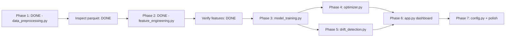

# Debutanizer C4 Slippage Model - Implementation Plan

---

## STATUS: Phase 1 Locked

**Output**: `data/clean_data.parquet` — 11,343 rows x **24 columns** (final, no further changes)
**Audit scripts**: `notebooks/analyze_data.py`, `notebooks/analyze_constraints.py`, `notebooks/inspect_clean_data.py`

> [!NOTE]
> Phase 1 is closed. Three bugs were fixed after the initial run (see F8). The parquet is the ground truth for all downstream work.

---

## Phase 1 Findings: What the Clean Data Actually Shows

These findings come from running `notebooks/inspect_clean_data.py` against the parquet output.
They update and replace some assumptions made during planning.

### F1. There Are 4 Data Blocks, Not 3

The gap structure is more complex than anticipated:

| Block | Start | End | Rows | Duration |
|-------|-------|-----|------|----------|
| 1 | 2023-04-16 | 2023-08-31 | 3,288 | 137 days |
| — | **Gap: 376 days** | — | — | — |
| 2 | 2024-09-11 | 2024-10-11 | 738 | 30.7 days |
| — | **Gap: ~43 hours** | — | — | — |
| 3 | 2024-10-13 | 2024-11-15 | 803 | 33.4 days |
| — | **Gap: 258 days** | — | — | — |
| 4 | 2025-08-01 | 2026-04-30 | 6,514 | 272 days |

Blocks 2 and 3 are separated by only 43 hours — they were originally treated as one "Block 2" but the gap exceeds the 24h threshold. They likely represent the same operating campaign. **Decision needed**: treat Blocks 2+3 as one campaign or keep separate. For lag computation, they must stay separate (43h gap = 43 missing lag rows).

> [!NOTE]
> Block 4 has 2 non-1h gaps (max 10 hours) within it. These are minor data dropouts, not campaign boundaries. Lag features around those 2 points will be NaN-padded and excluded from training.

### F2. The Bimodal Temperature Split is Entirely Block-Driven

This is the single most important finding from the inspection.

| Block | Reboiler Temp (mean) | Regime |
|-------|---------------------|--------|
| 1 | 35.9°C | **100% cold** (below 50°C) |
| 2 | 108.0°C | **100% hot** (above 50°C) |
| 3 | 93.2°C | Mixed (15% cold, 85% hot) |
| 4 | 71.7°C | Mixed (~49% cold, ~51% hot) |

**Block 1 is entirely in the cold reboiler regime. Block 2 is entirely in the hot regime.**

This means the "bimodal distribution" is not two concurrent operating modes — it is the difference between *operating periods*. The column was running differently in 2023 than in 2024-2026 (possibly different feed composition, different season, or equipment changes).

**Implications**:
1. **No K-Means needed** — regime is essentially captured by the block label or the actual temperature values. The tree model will learn `if Reboiler_Outlet_Temp < 50` as a natural split, which is the right behaviour.
2. The `Data_Block` label itself carries regime information and should be included as a categorical feature in the model.
3. C4 slippage between cold and hot regimes is nearly identical (cold: 0.52 wt%, hot: 0.46 wt%), so the regime is not a strong predictor of C4 level on its own — but it may interact with other variables in ways the tree will capture.

### F3. C4H6 Analyzer Often Freezes at Zero — This Is Not a Valid Value

During stuck periods, the C4H6 analyzer statistics are:

```
C4H6 STUCK periods:  mean=0.010, median=0.000, P75=0.000
C4H6 NORMAL periods: mean=0.072, median=0.009, P75=0.081
```

The median stuck value is **exactly 0.000**. When the C4H6 analyzer freezes, it usually freezes at or near zero — meaning it is **not** reporting a real low-C4H6 condition, it is reporting nothing. This is critical for Model B:

- **Original plan**: Train Model B (C4H6 predictor) on non-stuck rows only
- **Refined**: Additionally check that C4H6 training rows have `C4H6_Bottom > 0.001` (exclude frozen-at-zero readings). There are rows where the analyzer reads zero and is not flagged as stuck (because the run length is < 12). These zeros may still be invalid.
- **Practical impact**: Model B's training set will be significantly smaller (~4,000-5,000 rows). This is acceptable; XGBoost handles this well.

### F4. C4H8 Stuck Readings Cluster at Two Extreme Values

During C4H8 stuck periods:
```
C4H8 STUCK periods: mean=0.603, P25=0.034, P50=0.034, P75=1.262
```

The 25th and 50th percentiles are 0.034, but the 75th is 1.262 — indicating the analyzer freezes at two very different levels: near its minimum and near its maximum. This is unusual. It suggests the C4H8 analyzer sometimes gets stuck reporting a false-high just as often as a false-low.

**Implication for Model A (C4H8 predictor)**: The 7.9% stuck C4H8 rows are not uniformly distributed in value space. If we train on all rows including stuck, we are teaching the model that some process conditions correspond to extreme-high or extreme-low C4H8 when they may not. Consider also filtering out C4H8 stuck rows from Model A training (not just the target but the label noise). Use the `C4H8_Bottom_stuck` flag.

### F5. Block 1 Has Significantly Higher C4 Slippage Than Later Blocks

| Block | Mean Total_C4 | % Above 0.5 spec |
|-------|--------------|-----------------|
| **1** | **0.602** | **59.6%** |
| 2 | 0.337 | 17.3% |
| 3 | 0.330 | 19.9% |
| 4 | 0.482 | 34.9% |

Block 1 has 60% of readings above spec — nearly double Block 4's rate. This is the earliest data (2023). Either the column was being operated more poorly in 2023, or the operating conditions were genuinely harder (higher feed, lower steam/reflux ratios).

Checking the per-block process stats:
- Block 1 Feed_Flow mean: **85.8 TPH** vs Block 4: **78.6 TPH** — Block 1 was running higher throughput
- Block 1 Reflux_Flow mean: **95.7 TPH** vs Blocks 2/3: **102.2 / 101.9 TPH** — lower reflux in Block 1
- Block 1 Reboiling_Steam mean: **21.3 TPH** vs Blocks 2/3: **23.8 / 24.3 TPH** — significantly less steam

**This physically explains the higher slippage in Block 1**: more feed, less steam, less reflux = worse separation. The model should learn this pattern from the data.

**Implication for train/test split**: We had planned Block 1+2 train, Block 4 test. Given that Block 1 has systematically different operating conditions *and* different C4 behavior, keeping it in training is correct — it gives the model exposure to high-slippage operating conditions that Block 4 also shows 35% of the time.

### F6. Winsorisation Clipped Exactly 114 Rows Per Column

Every single column had exactly 114 rows clipped (57 at the low end for some, 57 at the high end for others, or 114 at one end and 0 at the other). This is unlikely to be a coincidence. These 114 rows are likely the **same rows** — a cluster of process upsets or abnormal operating periods that manifest as extreme values across all variables simultaneously.

**Action for feature engineering**: Flag these 114 rows as `is_extreme_event = True`. Check whether C4 slippage during these periods is systematically different. If these are real upset events, the model needs to learn from them; if they are sensor errors, they should be excluded.

### F7. Sampling Is Perfect Within Blocks (With 2 Minor Exceptions)

- Blocks 1, 2, 3: **zero** non-1h intervals — perfectly regular hourly data
- Block 4: **2 gaps** of up to 10 hours

The 2 gaps in Block 4 are manageable. Lag features touching those gaps will be NaN and excluded during training (standard time-series treatment).

### F8. Three Bugs Fixed After Initial Run — Final Parquet Has 24 Columns

After the first clean run was inspected, three issues were identified and fixed before Phase 1 was locked.

**Bug 1 — Floating-point equality in stuck detection (real bug, not style):**
The original `series.diff().eq(0)` misses cases where a historian (Exaquantum, OSI PI) writes the same reading with tiny floating-point noise — e.g., `0.07980082929134369` vs `0.0798008292913436`. Replaced with `np.isclose()` using a relative tolerance of `1e-6`.

Impact measured: C4H6 stuck count increased from **4,125 → 4,140 rows** (+15 rows that were being silently missed). Small but real.

**Bug 2 — Exact-zero shutdown detection:**
The original `== 0` comparison misses soft shutdowns where historian writes `0.001` during ramp-down. Replaced with `< SHUTDOWN_THRESHOLD` (currently 0.5 TPH/degC).

Impact on this dataset: still **56 rows removed** (confirming those rows were hard zeros). The fix future-proofs against different historian export settings.

**Addition — `Analyzer_Health` categorical column:**
Derived from `max(hours_since_C4H6_change, hours_since_C4H8_change)` and bucketed:

| Status | Threshold | Rows | % of dataset |
|--------|-----------|------|--------------|
| GOOD | Both changed within 12h | 7,928 | **69.9%** |
| WARNING | At least one unchanged 12-24h | 579 | 5.1% |
| BAD | At least one unchanged >24h | 2,836 | **25.0%** |

**25% of the dataset has at least one analyzer in BAD state.** This is immediately useful to operators as a standalone indicator on the dashboard, independent of C4 prediction. Costs nothing to compute since `hours_since_*` is already produced by stuck detection.

---

## Model Constraints & Operating Limits

> [!CAUTION]
> The optimizer must **never** recommend values outside safe operating limits. Safety constraints are **absolute ceilings** — they override the optimization objective.

### Safety Ceilings (Hard-Coded, Non-Negotiable)

| Variable | Safety Ceiling | Consequence If Exceeded |
|----------|---------------|-------------------------|
| **Column Bottom Temp** | **<= 115 degC** | Alarm / potential shutdown |
| **Column Top Pressure** | **<= 5.0 kg/cm2g** | Pressure trip / emergency depressuring |

```python
# Hard-coded in optimizer - NOT configurable, NOT overridable
SAFETY_CEILINGS = {
    'Column_Bottom_Temp': 115.0,   # degC - absolute max, alarm threshold
    'Column_Top_Pressure': 5.0,    # kg/cm2g - trip threshold
}
```

### Manipulable Variables (Optimizer Can Adjust)

| Variable | Unit | Hard Min | Rec. Min | Mean | Rec. Max | Hard Max | Max d/hr |
|----------|------|----------|----------|------|----------|----------|----------|
| Reboiling Steam Flow | TPH | 14.4 | 18.0 | 21.0 | 24.4 | 25.3 | +/-2.0 |
| Reflux Flow | TPH | 70.4 | 80.0 | 91.1 | 103.9 | 105.7 | +/-5.0 |

### Monitored Variables (Optimization Constraints)

| Variable | Unit | Rec. Min | Mean | Rec. Max | Safety Ceiling |
|----------|------|----------|------|----------|----------------|
| Column Bottom Temp | degC | 102.6 | 107.0 | 111.5 | **115.0 (absolute)** |
| Control Tray Temp | degC | 59.1 | 71.6 | 89.7 | -- |
| Column Top Pressure | kg/cm2g | 3.85 | 4.05 | 4.45 | **5.0 (absolute)** |

### Clarification Needed: "+/-50%" Constraint

> [!WARNING]
> Stakeholders mentioned "plus or minus 50%" for model recommendations. Three possible interpretations:
>
> | Interpretation | Steam Example (current = 21 TPH) | Effective Range |
> |---------------|----------------------------------|----------------|
> | +/-50% of **current value** | 21 +/- 10.5 | 10.5 - 31.5 TPH |
> | +/-50% of **operating range** (18-24.4) | midpoint +/- 3.2 | 17.9 - 24.3 TPH |
> | +/-50% of **mean** | 21 +/- 10.5 | 10.5 - 31.5 TPH |
>
> **Current implementation**: Data-derived P5-P95 ranges with +/-2 TPH/hr rate limit. Confirm with IOCL which interpretation is intended.

---

## STATUS: Phase 2 Locked

**Output**: `data/features.parquet` — 11,343 rows × **92 columns** (final, no further changes)
**Audit scripts**: `notebooks/analyze_phase2.py`, `notebooks/verify_features.py`, `notebooks/check_extreme_rows.py`

> [!NOTE]
> Phase 2 is closed. Feature set verified: no block leakage, 664 NaN cells all at block boundaries (correct), extreme events flagged correctly.

---

## Phase 2 Findings: What Feature Engineering Revealed

### F9. Extreme Events Are 1,392 Rows — Not 114

The plan said "114 winsorised rows" because the per-tail, per-column clip count is 114. But 114 is not the number of unique rows affected — it is the count per tail per column. Because each column clips different rows at each tail, the union of all clipped rows is **1,392 rows (12.3% of the dataset)**.

| Block | Extreme Events | % of Block |
|-------|---------------|------------|
| 1     | 480           | 14.6%      |
| 2     | 237           | **32.1%**  |
| 3     | 209           | **26.0%**  |
| 4     | 466           | 7.2%       |

**Key observations:**
- Blocks 2 and 3 have a disproportionately high extreme-event rate (32% and 26%) despite being the shortest blocks. This may indicate the plant was in a transitional or unstable operating period after the 376-day gap in 2024.
- C4 during extreme events: mean **0.622 wt%** (vs. 0.479 for normal rows) — extreme events have ~30% higher C4 on average.
- 47.7% of extreme-event rows exceed the 0.5 spec limit vs. 38.8% for normal rows.
- Extreme events are spread across all 4 blocks (not concentrated in one block), so they likely represent real process upsets, not sensor errors.

**Decision: Keep all 1,392 extreme-event rows in training.** The model needs to learn behaviour at operating boundaries. The `is_extreme_event` flag is preserved for post-hoc analysis and potential sample-weighting experiments.

### F10. Temp_Gradient is Bimodal — It is a Regime Indicator, Not a Continuous Feature

The `Temp_Gradient = Column_Bottom_Temp − Column_Top_Temp` has a striking bimodal distribution:

```
P50: -0.112   (near-zero — cold regime, Bottom ≈ Top)
P60: 64.334   (large positive — hot regime, Bottom >> Top)
```

P40 is -0.26, P60 is 64.3 — the entire middle 20% of the distribution jumps 64°C. This is because:
- **Block 1 (cold)**: Temp_Gradient mean = **-0.39°C** (bottom and top nearly equal — column not fully operational)
- **Block 2 (hot)**: Temp_Gradient mean = **+70.21°C** (normal fractionation — large thermal gradient)

This means Temp_Gradient provides very strong regime information for the tree model, but is essentially a restatement of `Data_Block` for Blocks 1 and 2. XGBoost will handle this via natural splits, but it's worth knowing the feature is not continuously informative.

Similarly, **Reboiler_Delta** (Reboiler_Outlet_Temp − Column_Bottom_Temp):
- Block 1: mean **-70.46°C** (reboiler outlet much colder than column bottom — abnormal)
- Block 2: mean **-0.30°C** (reboiler outlet ≈ column bottom — normal tight control)

This extreme regime difference across blocks further confirms that `Data_Block` is the single most important splitting feature for the tree.

### F11. Strongest Correlations With Total_C4 Come From Ratios, Not Raw Variables

Linear (Pearson) correlations of Tier 1 features with `Total_C4`:

| Feature | Abs. Correlation |
|---------|------------------|
| `Steam_Feed_Ratio` | **0.3239** |
| `Reflux_Ratio` | **0.2847** |
| `Column_Top_Pressure` | 0.2422 |
| `Feed_Flow` | 0.2146 |
| `Reflux_Flow` | 0.0989 |
| `Reboiler_Outlet_Temp` | 0.0634 |
| `Column_Bottom_Temp` | 0.0181 |

**Key insight:** The two engineered ratios (`Steam_Feed_Ratio`, `Reflux_Ratio`) are the strongest linear predictors — stronger than any raw variable. This validates the feature engineering decision. Raw `Reboiling_Steam_Flow` has correlation 0.055 but `Steam_Feed_Ratio` has 0.324 — a **6× improvement** from normalising by feed.

However, linear correlations understate tree model performance. XGBoost will use the lags and rolling stats in non-linear combinations. Expect the model's effective signal to be significantly higher than 0.32.

### F12. NaN Profile Is Exactly as Expected — No Surprises

Total NaN cells: **664** across 51 columns.

- All NaNs are at block boundaries (first 12 rows of each block hold lags up to lag-12)
- Each block contributes exactly 12 NaN rows (one per block × 4 blocks = 48 NaN-affected rows total)
- No NaNs in any other position — confirms within-block lag/rolling logic is correct
- Rows with any NaN per block: exactly 12 per block (same 12 rows — the first N rows where N = max lag = 12)
- These 48 rows will be dropped during model training (`dropna()`) — immaterial given training set sizes

**Verification confirmed:** No data leakage across block boundaries. Lag-1 and rolling-std values are NaN for every first row of each block.

### F13. Confirmed Training Set Sizes (After All Filters + NaN Drop)

| Model | Train (Blocks 1-3) | Test (Block 4) | Notes |
|-------|-------------------|----------------|-------|
| **Model A** (C4H8) | **4,332 rows** | **6,081 rows** | Excludes C4H8_stuck rows; drops 12 NaN rows per block |
| **Model B** (C4H6) | **3,556 rows** | **2,974 rows** | Excludes C4H6_stuck AND C4H6 < 0.001; smaller valid set |

> [!WARNING]
> Model B's training set (3,556 rows) is ~18% the size of Model A's. XGBoost's default `n_estimators=100` may be sufficient, but use `early_stopping_rounds=30` and monitor validation loss carefully. Stronger regularisation (`reg_alpha=1`, `reg_lambda=5`, lower `learning_rate=0.05`) recommended as starting point.

Extreme events in Model A training set: **903 rows (20.8%)** — well-distributed, will be kept.

### F14. Tier 1 vs Tier 2 Feature Sets Confirmed

| Tier | Features | Description |
|------|----------|-------------|
| **Tier 1** (Production) | **67** | Process-only: current values + lags + rolling + ratios + diffs + time + block |
| **Tier 2** (Research) | **82** | Tier 1 + 15 target lags (C4H8 lag 1-12, C4H6 lag 1-3) |

The 15 additional target-lag columns are already in `features.parquet` but will only be selected during Tier 2 training.

### F15. Operator Instability Captured by Rolling Std Features

Rolling std of key manipulable variables (6h window):

| Feature | Mean | Std | P95 (high instability) |
|---------|------|-----|------------------------|
| `Reboiling_Steam_Flow_roll_std_6h` | 0.257 TPH | 0.241 | **0.703 TPH** |
| `Reflux_Flow_roll_std_6h` | 0.273 TPH | 0.698 | **1.458 TPH** |
| `Feed_Flow_roll_std_6h` | 2.131 TPH | 1.890 | **6.216 TPH** |

These features capture **operator behaviour patterns** — erratic steam or reflux adjustments over 6 hours signal poor control. P95 of Feed instability is 6.2 TPH/6h — at those moments, feed variability is 3× the mean steam flow. The dashboard can surface this as a direct operator coaching metric.

---

## Phase 2 Outputs (Locked)

**Feature set produced by `feature_engineering.py`:**

| Category | Planned | Actual | Notes |
|----------|---------|--------|-------|
| Core process vars | 8 | 8 | ✓ |
| Process lags | ~32 | 32 | ✓ Steam×5, Reflux×4, Feed×3, BotTemp×3, CTTray×4, ReboilerTemp×3, TopTemp×2, TopPress×2 |
| Rolling means | 12 | 12 | ✓ |
| Rolling stds | 6 | 6 | ✓ |
| Engineered ratios | 4 | 4 | ✓ |
| Rate-of-change | 4 | 4 | ✓ |
| Time cyclical | 6 | 6 | ✓ |
| Block label | 1 | 1 | ✓ |
| **Tier 1 Total** | ~73 | **67** | Slight difference from plan: `Data_Block` counted as 1, no dummy encoding |
| Target lags (Tier 2) | 15 | 15 | C4H8×12 + C4H6×3 |
| **Tier 2 Total** | ~88 | **82** | ✓ |
| Metadata flags | — | 5 | `is_extreme_event` + stuck flags + hours_since + Analyzer_Health |

---

## Phase 3 Plan: Model Training

### Overview

Train two XGBoost regressors (Model A and Model B) on Tier 1 features to predict `C4H8_Bottom` and `C4H6_Bottom` respectively. Combine predictions as `Total_C4 = pred_C4H8 + pred_C4H6`. Train Tier 2 models for comparison. Evaluate on Block 4 (held-out test set).

### Step 1 — Establish Baselines (Compute Before Training)

Report these before touching any ML model. These are the bar to beat:

| Baseline | How to Compute | Expected Score |
|---------|----------------|----------------|
| **Naive lag-1** | `Total_C4(t) ≈ Total_C4(t-1)` — requires analyzer | Best baseline, but uses analyzer |
| **Block mean** | Predict the mean `Total_C4` per block | Weak baseline (0.0 R² by definition within block) |
| **Overall mean** | Always predict 0.497 | R² = 0.0 by definition |

> [!IMPORTANT]
> The naive lag-1 baseline uses the analyzer — which is exactly what we want to replace. Report its R² on the test set first. Our Tier 1 model (no analyzer) must be compared against it directly: "We get R²=0.84 without any analyzer vs R²=0.97 with a working analyzer".

### Step 2 — Feature Selection (Tier 1 Column List)

Explicitly define the columns used for training (to avoid accidentally including metadata):

```python
META_COLS = [
    "DateTime", "C4H6_Bottom", "C4H8_Bottom", "Total_C4",
    "C4H6_Bottom_stuck", "C4H8_Bottom_stuck",
    "hours_since_C4H6_Bottom_change", "hours_since_C4H8_Bottom_change",
    "Analyzer_Health", "is_extreme_event",
    # Tier 2 only — excluded from Tier 1:
    "C4H8_Bottom_lag1",  # ... lag2 through lag12
    "C4H6_Bottom_lag1",  # ... lag2, lag3
]
TIER1_FEATURES = [c for c in df.columns if c not in META_COLS]
# → 67 features
```

### Step 3 — Train/Test Split Strategy

```
Train:  Blocks 1 + 2 + 3  (4,332 rows for Model A; 3,556 for Model B)
Test:   Block 4           (6,081 rows for Model A; 2,974 for Model B)
```

**Note**: Test set (Block 4) is larger than train for Model A. This is intentional — Block 4 is the most recent data and will be the production deployment context. Overfitting to older blocks is less of a concern than generalising to Block 4 operating conditions.

For cross-validation during hyperparameter tuning, use **TimeSeriesSplit** with `n_splits=3` applied within the training blocks only (no leakage across the train/test boundary).

### Step 4 — Hyperparameter Grid (XGBoost)

Start with the following grid, tuned per model:

**Model A (C4H8) — larger train set:**
```python
params_A = {
    "n_estimators":    [200, 400, 600],
    "max_depth":       [4, 6, 8],
    "learning_rate":   [0.05, 0.1],
    "subsample":       [0.7, 0.85],
    "colsample_bytree":[0.6, 0.8],
    "reg_alpha":       [0, 0.5],
    "reg_lambda":      [1, 3],
    "min_child_weight":[1, 5],
}
```

**Model B (C4H6) — smaller train set, stronger regularisation:**
```python
params_B = {
    "n_estimators":    [100, 200, 400],
    "max_depth":       [3, 4, 6],
    "learning_rate":   [0.03, 0.05, 0.1],
    "subsample":       [0.6, 0.75],
    "colsample_bytree":[0.5, 0.7],
    "reg_alpha":       [0.5, 1, 2],        # stronger alpha for small dataset
    "reg_lambda":      [3, 5, 10],         # stronger lambda
    "min_child_weight":[3, 10, 20],        # prevent overfitting small leaves
}
```

Use `early_stopping_rounds=30` with a held-out validation split from training data (last 500 rows of training chronologically).

### Step 5 — Metrics to Report

For each model and each tier:

| Metric | Formula | Threshold to Beat |
|--------|---------|-------------------|
| R² | Standard | > naive lag-1 baseline |
| MAE (wt%) | Mean |Abs| Error | < 0.10 wt% (operator-relevant) |
| RMSE (wt%) | Root Mean Sq. Error | < 0.15 wt% |
| % within ±0.1 wt% | Fraction of predictions close to truth | > 70% |
| % above-spec correctly flagged | Recall for Total_C4 > 0.5 | > 80% |

Report metrics **separately for extreme-event rows vs normal rows** — this tests whether the model handles upsets correctly or only works in normal conditions.

### Step 6 — Feature Importance Analysis

After training, extract:
1. `model.feature_importances_` (gain-based) — which features drive splits the most
2. Plot top 20 features for Model A and Model B separately
3. Check: do `Steam_Feed_Ratio` and `Reflux_Ratio` rank in the top 10? They had the strongest linear correlations.
4. Check: does `Data_Block` rank highly? If so, it means the regime split is critical — consider separate models per block in Phase 3.5.

### Step 7 — Tier 2 (Research) Model Training

Train a parallel XGBoost with the same architecture but `TIER2_FEATURES` (adds 15 target lags).

Expected outcome:
- Tier 2 R² should be 0.05–0.15 higher than Tier 1
- If the gap is < 0.05: the process variables already explain most of the variance (great news for production)
- If the gap is > 0.20: the production model needs work; consider adding more lag windows

This comparison is a deliverable for IOCL management: **"Here is the performance cost of the unreliable analyzer."**

### Step 8 — Combine Models into Total_C4

```python
df["pred_C4H8"] = model_A.predict(X_test_A)
df["pred_C4H6"] = model_B.predict(X_test_B)
df["pred_Total_C4"] = df["pred_C4H8"] + df["pred_C4H6"]
```

Evaluate combined `Total_C4` prediction with the same metrics as individual models. The combined error may be higher or lower depending on correlation of individual errors.

### Step 9 — Save Artefacts

```python
model_A.save_model("models/model_A_C4H8.json")
model_B.save_model("models/model_B_C4H6.json")
pd.DataFrame(results).to_csv("models/training_metrics.csv")
```

Save predictions on the test set as `models/test_predictions.parquet` for the dashboard to use.

### Phase 3 — What to Check Visually Before Moving On

1. **Residual plot**: `pred_Total_C4 - Total_C4` vs time — should be random noise, not trending
2. **Residual vs feature**: residuals plotted against `Steam_Feed_Ratio` — should show no pattern
3. **Block 4 residuals over time**: check for model drift within Block 4 (if later dates have larger errors, the model may be drifting)
4. **Confusion matrix** at 0.5 spec threshold: how often does the model miss an out-of-spec event?

---

## Model Architecture: Two-Tier Strategy

> [!CAUTION]
> **Why NOT use lagged C4 as input in the production model?**
>
> IOCL is building this soft sensor because the analyzer is unreliable (stuck for 37 days), slow (12-min cycle), and lab results are delayed (2 hrs). If we use `C4_lag1` as a feature, we get amazing R2 but built a model that says "tomorrow's C4 = today's C4". The moment the analyzer freezes, our strongest feature becomes stale, and the model collapses.
>
> The production soft sensor must predict C4 **purely from process variables** -- that's the whole point.

### Model Tier 1: Production Soft Sensor
- Features: **67** process-only features (confirmed from Phase 2)
- Sub-models: Model A (C4H8) + Model B (C4H6)
- Total C4 = Model A output + Model B output

### Model Tier 2: Research Model (Comparison Only)
- Features: **82** (Tier 1 + 15 lagged C4 values)
- Expected comparison: Soft Sensor R² ~0.80–0.87, Research R² ~0.90–0.95
- Demonstrates value of reliable analyzer to management

---

## Performance Goals

| Metric | Goal | Notes |
|--------|------|-------|
| **Primary** | Beat naive lag-1 baseline | If we can't beat "C4(t) = C4(t-1)" with process vars, the model has no value |
| **Stretch** | R² > 0.85 for Production Soft Sensor | Industrial datasets are messy -- 0.85 is excellent |
| **Comparison** | Show gap: Soft Sensor R² vs Research Model R² | Quantifies analyzer value for management |
| **MAE** | < 0.10 wt% | Operators can act on ±0.1 wt% guidance |
| **Spec detection** | > 80% recall for Total_C4 > 0.5 | Missing out-of-spec events is worse than false alarms |

> [!IMPORTANT]
> **No hard R² promises.** Even R² = 0.80 with a process-only model is significant. Report honest metrics. The goal is to quantify what we replaced, not to overfit.

---

## Execution Order



---

## File Inventory

| File | Purpose | Status |
|------|---------|--------|
| `data_preprocessing.py` | Phase 1 pipeline (3 bugs fixed, locked) | **Done** |
| `data/clean_data.parquet` | 11,343 rows × 24 columns — final | **Done** |
| `notebooks/analyze_data.py` | Audit: lag/stuck/correlation analysis | Preserved |
| `notebooks/analyze_constraints.py` | Audit: operating limits derivation | Preserved |
| `notebooks/inspect_clean_data.py` | Audit: post-preprocessing visual inspection | Done |
| `notebooks/check_extreme_rows.py` | Audit: extreme events (winsorised rows) analysis | Done |
| `notebooks/verify_features.py` | Audit: block leakage check, NaN profile | Done |
| `notebooks/analyze_phase2.py` | Audit: feature correlations, training set sizes | Done |
| `notebooks/generate_diagnostic_plot.py` | Diagnostic scatter plot generator | Done |
| `feature_engineering.py` | Phase 2 pipeline (locked) | **Done** |
| `data/features.parquet` | 11,343 rows × 92 columns — final feature set | **Done** |
| `model_training.py` | Phase 3 | **Next** |
| `models/model_A_C4H8.json` | Trained XGBoost for C4H8 | Pending |
| `models/model_B_C4H6.json` | Trained XGBoost for C4H6 | Pending |
| `models/training_metrics.csv` | All model metrics | Pending |
| `models/test_predictions.parquet` | Test set predictions (for dashboard) | Pending |
| `optimizer.py` | Phase 4 | Pending |
| `drift_detection.py` | Phase 5 | Pending |
| `app.py` | Phase 6 dashboard | Pending |
| `config.py` | Central config + constraints | Pending |
